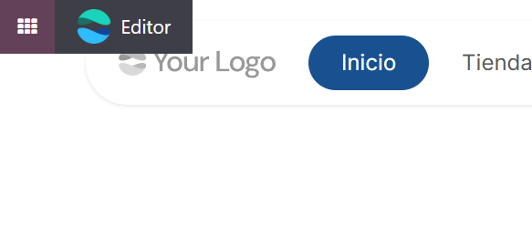
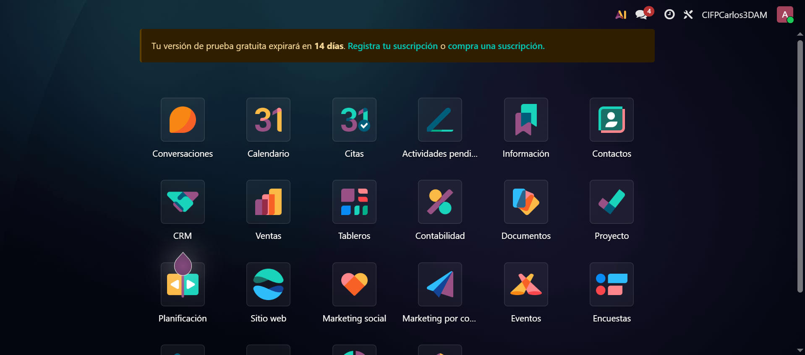
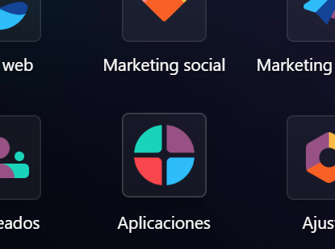
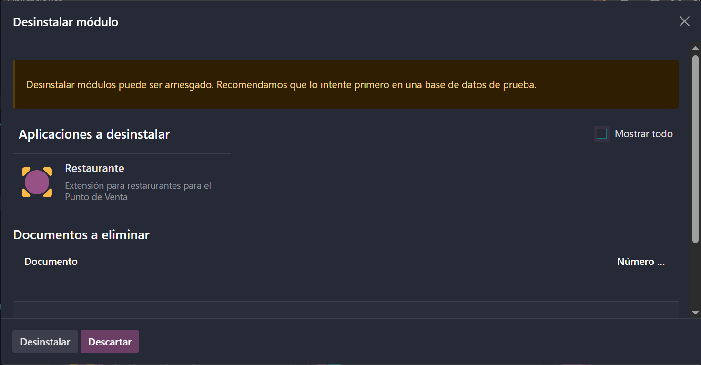

# 03 — Instalación y prueba (15 días) / Alta e instalación de apps

En este punto vamos a aprender a instalar Odoo en cloud, para este ejemplo usaremos una prueba gratuita de 15 días y nos daremos de alta instalando así hasta 10 módulos.

## Requisitos previos

- Navegador actualizado (sin VPNs, ni adblock).
- Cuenta de correo para alta (en nuestro caso crearemos una cuenta de correo nueva para este ejemplo).

## Pasos

1. **Acceso a la web y elección de plan de suscripción**.
   Primeramente entraremos a la página web de Odoo a través del siguiente enlace: [Odoo](https://www.odoo.com/es_ES/pricing)
   Debería mostrarse una pantalla como esta:
   

   Veremos las diferentes suscripciones eligiendo entre pagos anuales o mensuales, nosotros en este caso de prueba nosotros elegiremos la opción de **prueba gratuita** del **plan Estándar**.
2. **Seleccionar apps iniciales** (máximo 10 en la prueba):
   Tras pinchar en la prueba gratuita veremos la siguiente pantalla para elegir hasta 10 módulos de prueba, iremos seleccionándolos uno a uno, en nuestro caso hemos elegido los módulos: **Sitio web Eventos CRM Ventas Facturación Contabilidad Proyecto Documentos Marketing por correo electrónico y Marketing social**. Si lo has hecho bien la pantalla debería de quedar así:
   

   Es importante si estás haciendo la prueba gratuita comprobar como bien dice en la captura **Prueba gratuita de 15 días** justo debajo de las aplicaciones seleccionadas, después pinchamos en **"Continuar"**.

   Tras esto nos llevará a una sección donde nos pedirán nuestros datos y un correo, ahí pondremos el correo que creamos para la prueba de 15 días gratuita, después pincharemos en el botón que dice **"Empezar ahora"**.
3. **Instalación de Odoo**.
   Ahora Odoo nos dará la bienvenida empezando a instalarse, además de hacernos unas preguntas para la personalización de nuestro sitio web, pero lo importante viene ahora **¡¡OJO!!** cuando hayamos terminado con las preguntas y nos haya llevado a una nueva ventana donde se nos crea una página web, buscaremos el siguiente botón arriba a la derecha que dice **"Activación pendiente"**:

   

   Es para **verificar nuestro correo electrónico**, nos enviarán un correo para confirmar **o la base de datos será borrada en 3 horas**. Tras esto y ver el sitio web creado por Odoo nos interesa ir al **panel de módulos**, desde el sitio web puedes acceder desde un pequeño panel desplegable en la esquina superior izquierda de la pantalla, haremos click en el botón morado que con el cursor encima dice **"Ir a sus aplicaciones de Odoo"**.
   

   Al hacer click veremos la siguiente pantalla con nuestros módulos:
   
4. **Instalar/Desinstalar apps** desde *Aplicaciones* (¡cuidado con los datos al desinstalar!).
   Desde el panel de módulos podemos instalar y desinstalar aplicaciones desde el siguiente menú al pinchar aquí donde dice **"Aplicaciones"**:
   

   Al entrar veremos un menú con todas las aplicaciones disponibles en nuestra versión, podremos filtrar por diferentes especificaciones de las aplicaciones, instalarlas es tan sencillo como al buscar la que quieres darle a **"Instalar"** y tras un tiempo de espera podrás ver tu aplicación en el panel (recuerda que si estás en la prueba gratuita sólo puedes tener 10 aplicaciones instaladas).

   Si lo que quieres es **desinstalar una aplicación** desde el mismo menú pinchas en los **tres puntitos** al lado de la aplicación y pinchas en **"Desinstalar" ¡¡OJO!!**, Odoo nos va a preguntar si estamos seguros de querer instalarla, ya que si la borramos **perderemos todos los datos de ese módulo**, es recomendable hacer un **backup** antes de desisntalar nada, si estamos seguros sólo voleveremos a pincha en el botón que dice **"Desinstalar"**.
   
## Resultado esperado

- Acceso al panel principal con las apps instaladas.
