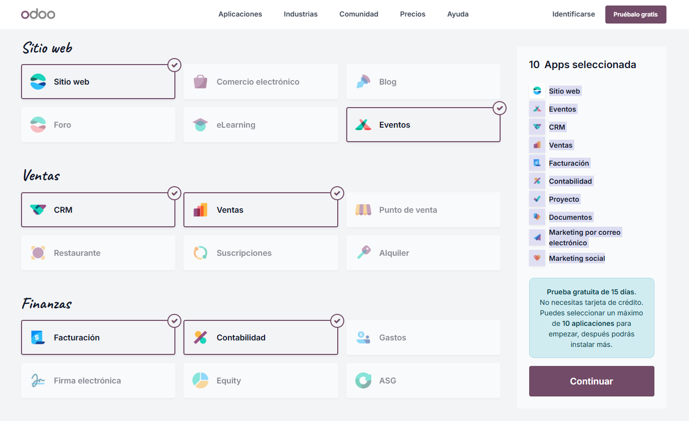
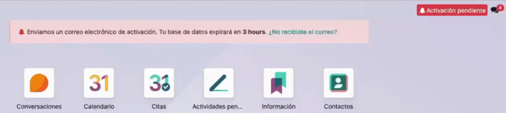

# 03 — Instalación y prueba (15 días) / Alta e instalación de apps

En este punto vamos a aprender a instalar Odoo en cloud, para este ejemplo usaremos una prueba gratuita de 15 días y nos daremos de alta instalando así hasta 10 módulos.

## Requisitos previos

- Navegador actualizado (sin VPNs, ni adblock).
- Cuenta de correo para alta (en nuestro caso crearemos una cuenta de correo nueva para este ejemplo).

## Pasos

1. **Acceso a la web y elección de plan de suscripción**.
   Primeramente entraremos a la página web de Odoo a través del siguiente enlace: [Odoo](https://www.odoo.com/es_ES/pricing)
   Debería mostrarse una pantalla como esta:
   ~~~~

   Veremos las diferentes suscripciones eligiendo entre pagos anuales o mensuales, nosotros en este caso de prueba nosotros elegiremos la opción de **prueba gratuita** del **plan Estándar**.
2. **Seleccionar apps iniciales** (máximo 10 en la prueba):
   Tras pinchar en la prueba gratuita veremos la siguiente pantalla para elegir hasta 10 módulos de prueba, iremos seleccionándolos uno a uno, en nuestro caso hemos elegido los módulos: **Sitio web Eventos CRM Ventas Facturación Contabilidad Proyecto Documentos Marketing por correo electrónico y Marketing social**. Si lo has hecho bien la pantalla debería de quedar así:
   

   Es importante si estás haciendo la prueba gratuita comprobar como bien dice en la captura **Prueba gratuita de 15 días** justo debajo de las aplicaciones seleccionadas, después pinchamos en **"Continuar"**.

   Tras esto nos llevará a una sección donde nos pedirán nuestros datos y un correo, ahí pondremos el correo que creamos para la prueba de 15 días gratuita, después pincharemos en el botón que dice **"Empezar ahora"**.
3. **Instalación de Odoo**.
   Ahora Odoo nos dará la bienvenida empezando a instalarse, además de hacernos unas preguntas para la personalización de nuestro sitio web, pero lo importante viene ahora **¡¡OJO!!** cuando hayamos terminado con las preguntas y nos haya llevado a una nueva ventana donde se nos crea una página web, buscaremos el siguiente botón arriba a la derecha que dice **"Activación pendiente"**:

   

   Es para **verificar nuestro correo electrónico**, nos enviarán un correo para confirmar **o la base de datos será borrada en 3 horas**. Tras asegurarnos de esto podemos observar que estamos en un sitio web nuestro creado por Odoo, pero nosotros queremos llegar al **panel de aplicaciones**, para esto desde la página web principal de Odoo pincharemos en nuestro perfil, se nos desplegará un pequeño panel, pincharemos en la opción **"Mis bases de datos"**, y de ahí veremos la base de datos que hemos creado y le daremos a **"Conectar"**, de ahí nos llevará al panel de módulos.
4. **Instalar/Desinstalar apps** desde *Aplicaciones* (¡cuidado con los datos al desinstalar!).

## Resultado esperado

- Acceso al panel principal con las apps instaladas.
