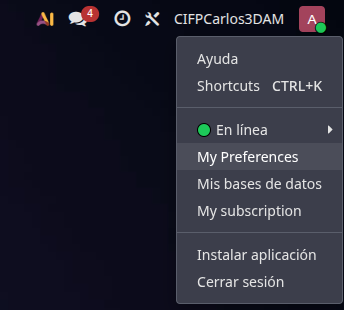
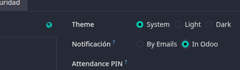
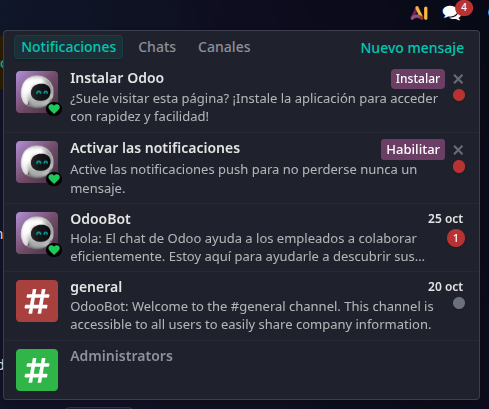
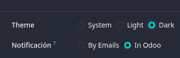
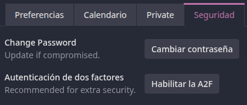
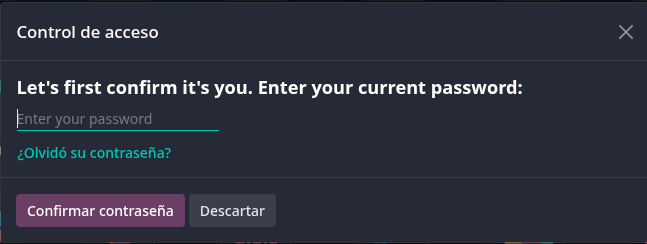
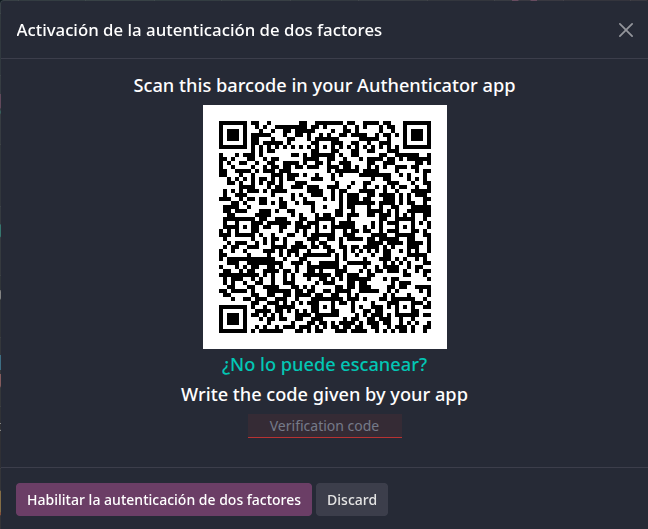

# 04 — Ajustes generales

- [Activar **notificaciones** y (opcional) **PWA**.](#activar-notificaciones-y-opcional-pwa)
- [Perfil: modo oscuro, datos, **2FA**, firma email, notificaciones en Odoo.](#perfil-modo-oscuro-datos-2fa-firma-email-notificaciones-en-odoo)
- [**Usuarios y compañías**: roles por módulo; en Enterprise se paga por usuario.](#usuarios-y-compañías-roles-por-módulo-en-enterprise-se-paga-por-usuario)
- [**Idiomas** y **diseño de documentos** (plantillas de factura).](#idiomas-y-diseño-de-documentos-plantillas-de-factura)
- [**Emails de resumen**: periodicidad y destinatarios.](#emails-de-resumen-periodicidad-y-destinatarios)

  ## Activar **notificaciones** y (opcional) **PWA**

  Si deseas activar las notificaciones en Odoo debes acceder al siguiente panel de usuario que se encuentra pinchando en el icono de nuestro usuario desde el panel principal de módulos:
  
  Tras pinchar se despliega este panel donde pincharemos en **"My Preferences"** y se nos abrirá una ventana en la que buscaremos el apartado de **"Notificación"**, veremos dos opciones, por defecto estará marcado **"By Emails"**, esta opción no la recomiendo ya que puede ser molesto tener emails de Odoo todos los días, es preferible tener activada la opción **"In Odoo"**, esto hará que las notificaciones se muestren en el panel de notificaciones en el panel principal lo cuál es más cómodo y visible (recuerda siempre al hacer cambios pinchar en **"Update Preferences"**).
  
  

  ## Perfil: modo oscuro, datos, **2FA**, firma email, notificaciones en Odoo.

  Para poner el perfil en modo oscuro volveremos al mismo panel de preferencias del punto anterior, y justo encima de configuramos las notificaciones veremos los ajustes de modo oscuro, donde dice **"Theme"**, podemos elegir que establezca el modo que tenga el sistema operativo, o directamente ponerlo en modo claro (Light) o modo oscuro (Dark), recomendamos ponerlo en modo oscuro para la vista siendo este más cómodo para el ojo.
  

  ---

  Ahora pasaremos a configurar la autenticación de dos pasos (2FA), para ello desde el panel de preferencias, en la barra de apartados pincharemos en el que pone **"Seguridad"**, una vez ahí veremos un apartado con una opción que dice **"Habilitar la A2F"** y pincharemos ahí.
  

  Tras pinchar nos pedirá confirmar con nuestra contraseña, con la que nos dimos de alta en Odoo.
  

  Tras introducir nuestra contraseña nos aparecerá un QR que debemos escanear con nuestra aplicación de autenticación e introducir el código que nos aparezca en la app para habilitar la 2FA.
  

  ## **Usuarios y compañías**: roles por módulo; en Enterprise se paga por usuario.

  ## **Idiomas** y **diseño de documentos** (plantillas de factura).

  ## **Emails de resumen**: periodicidad y destinatarios.
