# 04 — Ajustes generales

- [Activar **notificaciones** y (opcional) **PWA**.](#activar-notificaciones-y-opcional-pwa)
- [Perfil: modo oscuro, datos, **2FA**, firma email, notificaciones en Odoo.](#perfil-modo-oscuro-datos-2fa-firma-email-notificaciones-en-odoo)
- [**Usuarios y compañías**: roles por módulo; en Enterprise se paga por usuario.](#usuarios-y-compañías-roles-por-módulo-en-enterprise-se-paga-por-usuario)
- [**Idiomas** y **diseño de documentos** (plantillas de factura).](#idiomas-y-diseño-de-documentos-plantillas-de-factura)
- [**Emails de resumen**: periodicidad y destinatarios.](#emails-de-resumen-periodicidad-y-destinatarios)

  ## Activar **notificaciones** y (opcional) **PWA**

  Si deseas activar las notificaciones en Odoo debes acceder al siguiente panel de usuario que se encuentra pinchando en el icono de nuestro usuario desde el panel principal de módulos:
  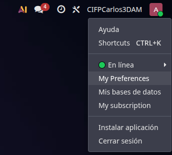
  Tras pinchar se despliega este panel donde pincharemos en **"My Preferences"** y se nos abrirá una ventana en la que buscaremos el apartado de **"Notificación"**, veremos dos opciones, por defecto estará marcado **"By Emails"**, esta opción no la recomiendo ya que puede ser molesto tener emails de Odoo todos los días, es preferible tener activada la opción **"In Odoo"**, esto hará que las notificaciones se muestren en el panel de notificaciones en el panel principal lo cuál es más cómodo y visible (recuerda siempre al hacer cambios pinchar en **"Update Preferences"**).
  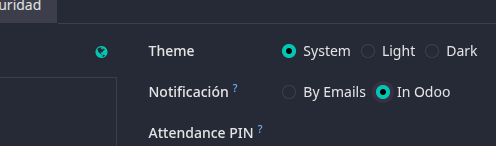
  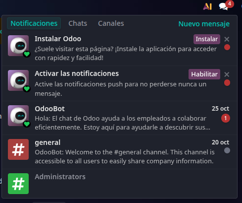

  ## Perfil: modo oscuro, datos, **2FA**, firma email, notificaciones en Odoo.

  Para poner el perfil en modo oscuro volveremos al mismo panel de preferencias del punto anterior, y justo encima de configuramos las notificaciones veremos los ajustes de modo oscuro, donde dice **"Theme"**, podemos elegir que establezca el modo que tenga el sistema operativo, o directamente ponerlo en modo claro (Light) o modo oscuro (Dark), recomendamos ponerlo en modo oscuro para la vista siendo este más cómodo para el ojo.
  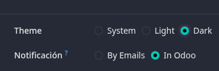

  ---

  Ahora pasaremos a configurar la autenticación de dos pasos (2FA), para ello desde el panel de preferencias, en la barra de apartados pincharemos en el que pone **"Seguridad"**, una vez ahí veremos un apartado con una opción que dice **"Habilitar la A2F"** y pincharemos ahí.
  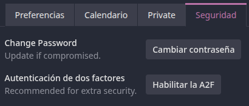

  Tras pinchar nos pedirá confirmar con nuestra contraseña, con la que nos dimos de alta en Odoo.
  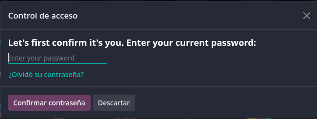

  Tras introducir nuestra contraseña nos aparecerá un QR que debemos escanear con nuestra aplicación de autenticación e introducir el código que nos aparezca en la app para habilitar la 2FA.
  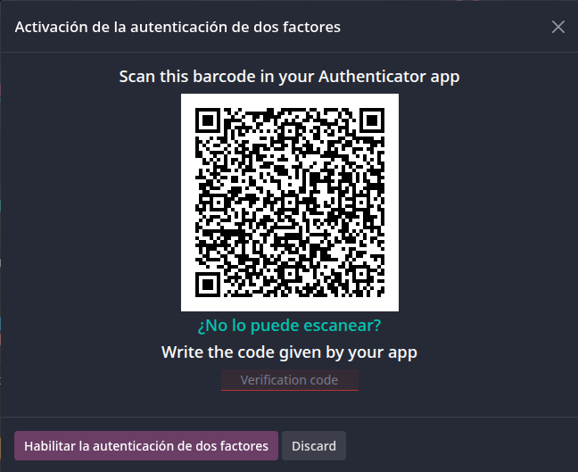

  ## **Usuarios y compañías**: roles por módulo; en Enterprise se paga por usuario.
  
  Si queremos acceder al panel de **"Usuarios y Compañías"** deberemos entrar en **"Ajustes"** y arriba veremos la opción para acceder, haremos click y veremos que podemos acceder a **"Usuarios"** o a **"Compañías"**:
  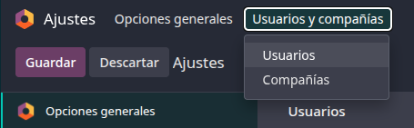

  Si accedemos al panel de Usuarios veremos una lista con todos los usuarios que tenemos en la base de datos junto con su nombre, el correo con el que inició sesión y su rol, además podemos encontrar un botón que dice **"Nuevo"** para crear un nuevo usuario:
  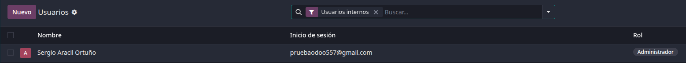

  Si pinchamos en un usuario veremos un panel donde podemos conultar y modificar sus datos, modificar su rol principal, establecer a qué módulos tiene acceso y con qué rol para cada módulo, incluso en el apartado preferencias configurar el idioma, notificaciones, tema. Además se podrá modificar su calendario y en seguridad podemo cambiar su contraseña, activar la 2FA, proporcionarle claves API, claves de acceso y consultar los dispositivos en los que se ha conectado.
  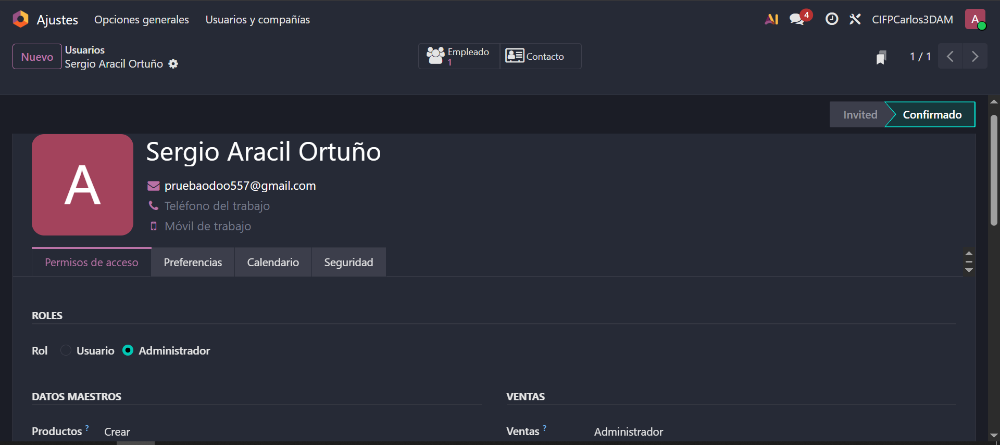

  ###### **Roles por módulo (Ejemplo):**
  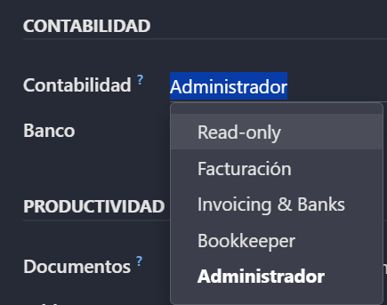

  Podemos **crear un usuario** si pinchamos en **"Nuevo"** configurándolo desde cero:
  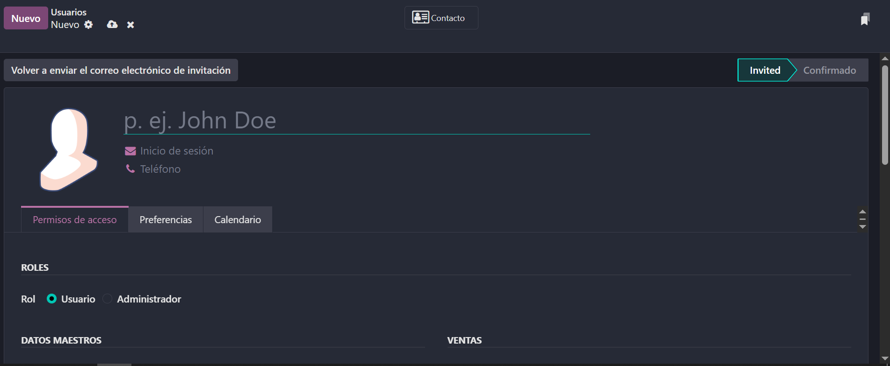

  Recuerda guardar aquí al realizar cualquier cambio en los usuarios:
  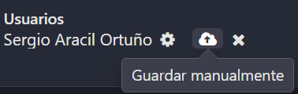

  Cabe rercalcar en la versión Community puedes tener **usuarios ilimitados**, en la versión **Enterprise debe pagar por cada usuario que deseas crear**.

  Si volvemos atrás y queremos pinchar en **"Compañías"** nos aparecerá otra lista con todas las compañías registradas, al pinchar en una podremos modificar sus datos en el siguiente panel:
  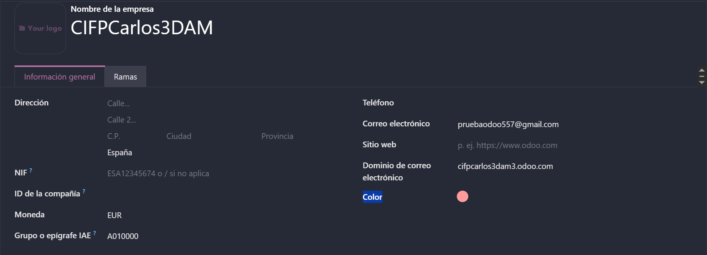

  Funciona exactamente igual que con los usuarios, guardamos al realizar todos los cambios y en **"Nuevo"** creamos una compañía desde cero.

  ## **Idiomas** y **diseño de documentos** (plantillas de factura).

  Desde el panel de **"Ajustes"** veremos una sección que pone **"Idioma"**, ahí podemos pinchar en **"Añadir idiomas"** y se nos desplegará una ventana donde podremos elegir un idioma e instalarlo:
  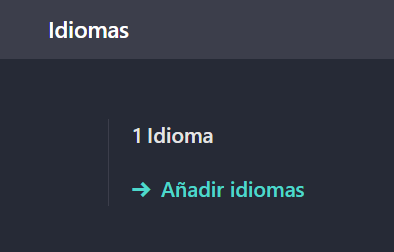
  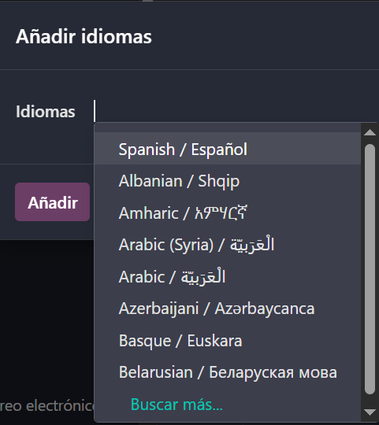

  Cuando tengamos nuestro idioma pinchamos en **"Añadir"** y si todo ha salido bien dirá que se ha instalado correctamente y podremos establecer ese idioma para cualquier usuario.

  Podemos personalizar el diseño de nuestras facturas si vamos de nuevo a **"Ajustes"** en la sección de **"Compañías"** podremos pinchar en **"Configurar diseño de documento"**:
  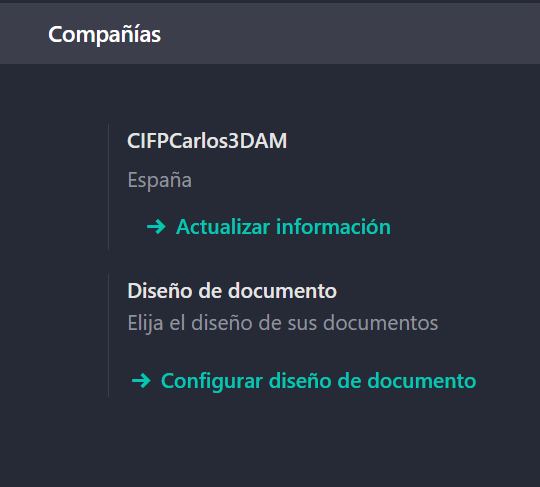

  Una vez dentro podremos personalizar el diseño de nuestras facturas con diferente plantillas, combiando el fondo, la fuente, añadiendo un logo etc.:
  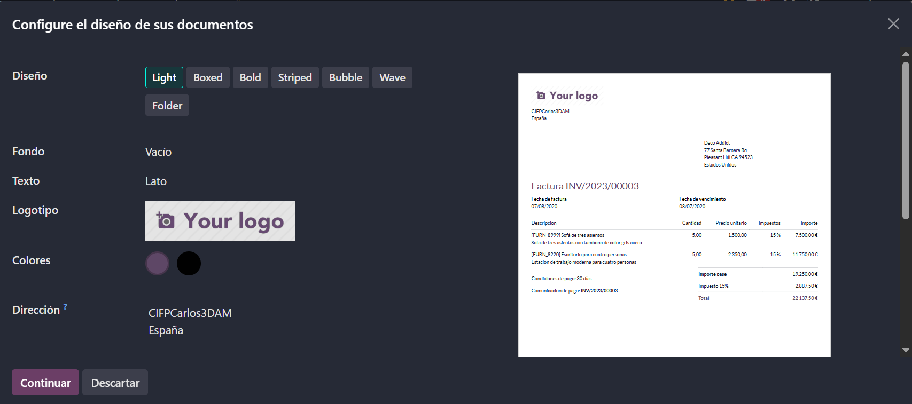

  ## **Emails de resumen**: periodicidad y destinatarios.

  Para configurar los correos de resumen en **"Ajustes"** tenemos otra sección que es **"Correos electrónicos"**, desde ahí pincharemos en **"Configurar correos electrónicos del resumen"**.
  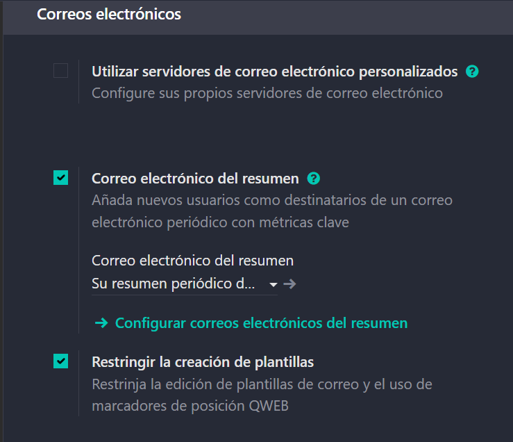

  Dentro veremos una lista con todos los informes que nos llegan y con qué frecuencia:
  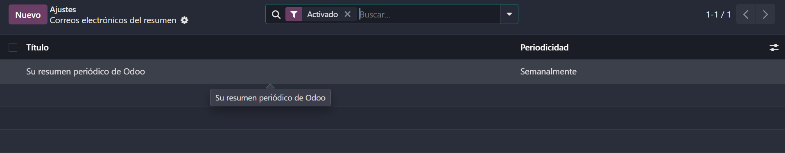

  Si abrimos uno podemos configurar la frecuencia con la que nos llega ese informe, el título, fecha del siguiente informe y qué datos de qué módulos queremos que nos lleguen. 
  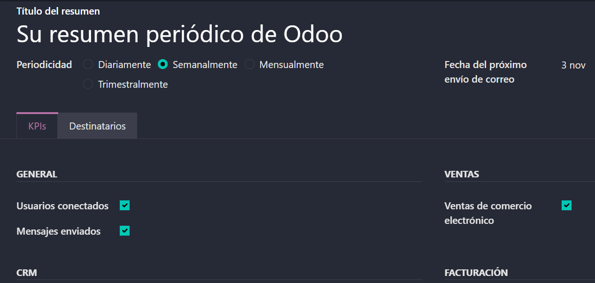

  En el apartado **"Destinatarios"** podemos configurar a quién le llegará este informe añadiendo nuevas líneas de destino.
  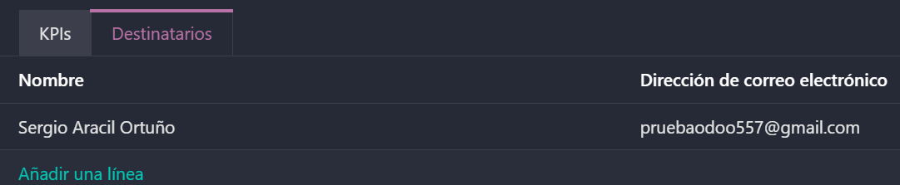

  Además pinchando en **"Nuevo"** podremos crear un nuevo informe configurándolo por completo.