# 05 — Integración con Gmail (OAuth GCP + Add-on)
En esta parte vamos a aprender a configurar la integración de Gmail en Odoo para gestionar correos, empresas, verificaciones etc. 
## Requisitos

- Cuenta Google Cloud (GCP).

## Pasos resumidos

1. [**Activar plugin de correo** en Odoo e instalar *Odoo Inbox Add-on* en Gmail.](#activar-plugin-de-correo-en-odoo-e-instalar-odoo-inbox-add-on-en-gmail)
2. [En **Google Cloud Console**: habilitar *Gmail API*, crear **OAuth Client (Web)**, configurar **redirect URI** de Odoo.](#en-google-cloud-console-habilitar-gmail-api-crear-oauth-client-web-configurar-redirect-uri-de-odoo)
3. [Copiar **Client ID/Secret** a Odoo (Gmail server settings) y **Guardar**.](#copiar-client-idsecret-a-odoo-gmail-server-settings-y-guardar)

## **Activar plugin de correo** en Odoo e instalar *Odoo Inbox Add-on* en Gmail.
Vamos a activar el plugin de correo en Odoo, para ello iremos a la app de **"Ajustes"**, ahora buscaremos el panel de **"Integraciones"**, ahí marcamos la casilla que pone **"Plugin de correo"** (Recuerda darle a **"Guardar"**).

---

Ahora instalaremos **"Odoo Inbox Add-on"**, para ello abriremos nuestro **"Gmail"**, buscaremos en el panel derecho el botón con el símbolo del + y pincharemos.

---

Ahora se nos desplegará una ventana donde podremos buscar el add-on, buscaremos **"Odoo Inbox Addin"** y tras encontrar el restultado pincharemos en instalar (Nos pedirá algunas verificaciones y permisos).

---

Una vez instalado veremos en el panel derecho de nuestro Gmail el icono de Odoo, al pinchar abriremos un panel que nos pedirá que **abramos un correo que tengamos**, veremos que en el panel aparece la persona que nos envió ese correo y un pequeño error que sugiere que **iniciemos sesión** abajo donde pone **"Login"**.

---

Deberás introducir la url de tu base de datos de Odoo para loguearte, luego nos pedirá permisos y pincharemos en **"Permitir"**, si tras esto vemos un mensaje que pone **"Success!"** es que lo has hecho bien, si no revisa los pasos anteriores.

---

Si refrescas la página podras ver en el panel muchos datos de la empresa que nos mandó el correo lo cual no será muy útil, en el icono del + al lado del nombre de la empresa podrás agregarla a tu base de datos (Veremos que desde ahí ya podremos crear oportunidades y tareas).

## En **Google Cloud Console**: habilitar *Gmail API*, crear **OAuth Client (Web)**, configurar **redirect URI** de Odoo.
Desde **"Ajustes"** de nuevo volveremos a ir al apartado de **"Integraciones"** y buscaremos y marcaremos la casilla que dice **"Autenticación OAuth"**, no se te olvide darle ahora a **"Guardar"** y después pincharemos en **"Proveedores OAuth"**.
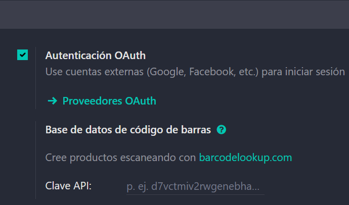

---

Al pinchar veremos la siguiente lista de proveedores:
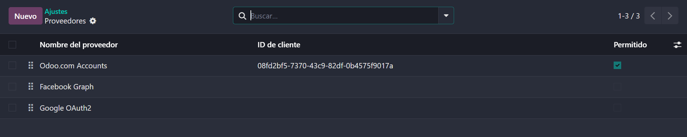

---

Antes de continuar por ahí iremos a **Google** y buscaremos **"Google Cloud Console"** y crearemos un nuevo proyecto.
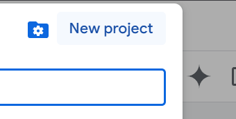

---

Ponemos nombre al proyecto y pinchamos en **"Create"**, al crearse aparecerá una notificación con un enlace que pone **"Select project"**, lo pinchamos para entrar en el proyecto creado.
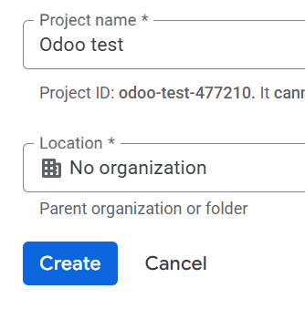

---

En la barra de búsqueda pondremos **"Gmail API"**, una vez en el resultado pinchamos en **"Enable"** (Esto puede tardar un tiempo).
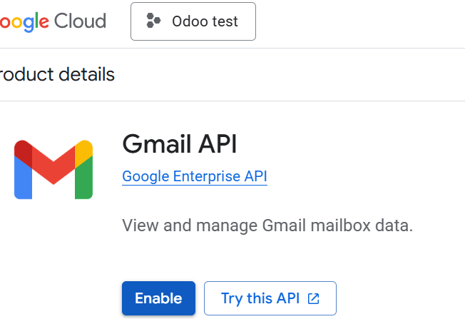

---

Cuando acabe y nos redirija pincharemos en el botón **"Create credentials"**.
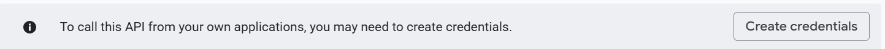

---

Al pinchar y ver una nueva pantalla marcaremos el punto de **"User data"** y pincharemos en **"Next"**.
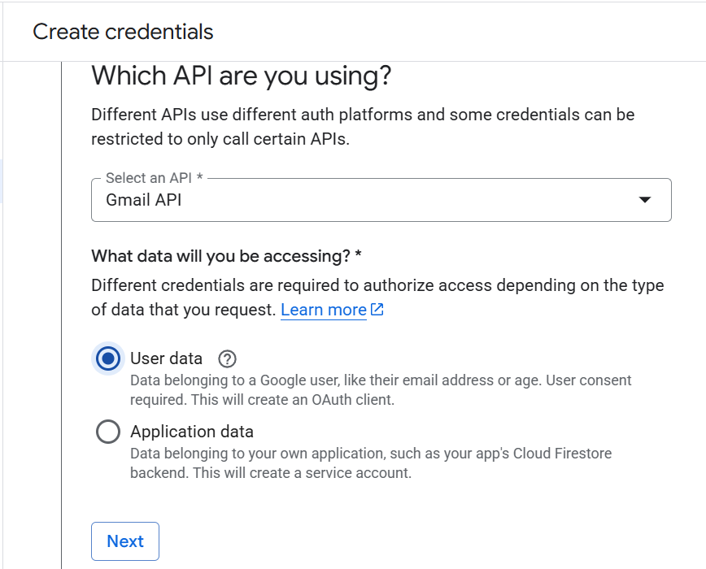

---

En el segundo punto pondremos el nombre de app que queramos, el email de soporte será el nuestro y el contacto de desarrollo también, tras esto pinchamos **"Save and continue"**.
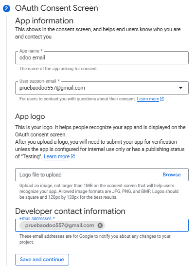

---

En el siguiente punto pincharemos en el botón **"Add or remove scopes"**, se nos abrirá un panel con los permisos que queremos dar (podemos filtrar por Gmail API).
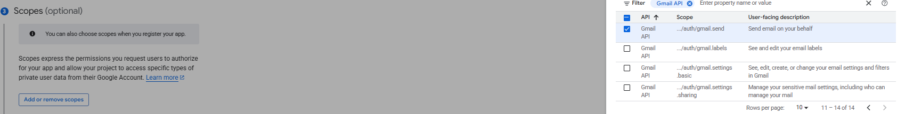

En nuestro caso añadimos los siguientes permisos (una vez elegidos volvemos a pinchar en **"Save and continue"**):
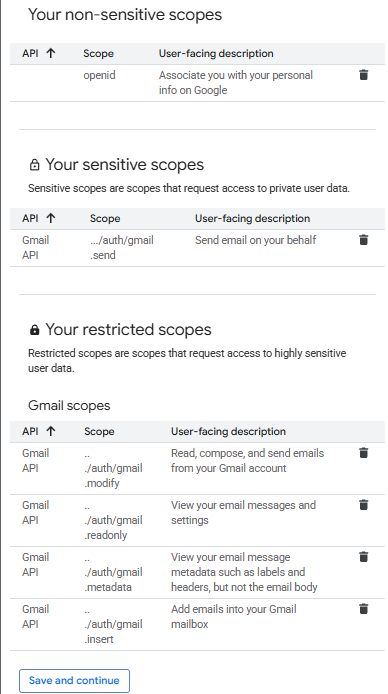

---

Ahora en este punto para el tipo de aplicación será en nuestro caso una aplicación web ,el nombre será el que quieras, y en la url debes poner la siguiente según tus datos (https://tunombre.odoo.com/google_gmail/confirm) sustituye tunombre por el tuyo que aparece en Odoo, lo verás en la url de tu navegador, después pinchamos en **"Create"** y tras terminar le damos a **"Done"**.
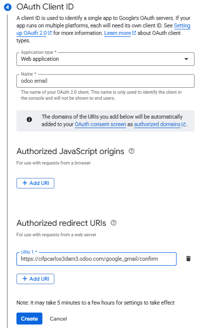

---

Sólo nos queda ir a **"Credentials"**...
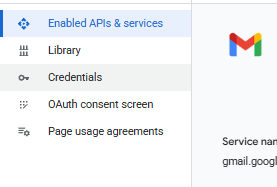

Pinchar aquí:
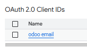

Y aquí tendremos la ID de cliente y el secreto de cliente, la copiamos:
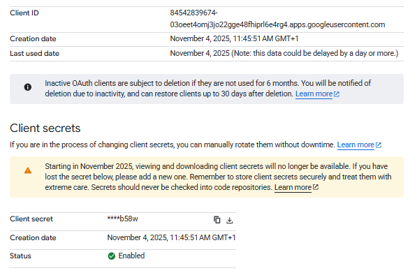

## Copiar **Client ID/Secret** a Odoo (Gmail server settings) y **Guardar**.
Luego volvemos a Odoo donde lo habíamos dejado, desde la lista de proveedores pinchamos en **"Google OAuth2"**, en **"ID Cliente"** pegamos al ID que copiamos, y activamos la casilla **"Permitido"** (recuerda pinchar en el icono de guardar).
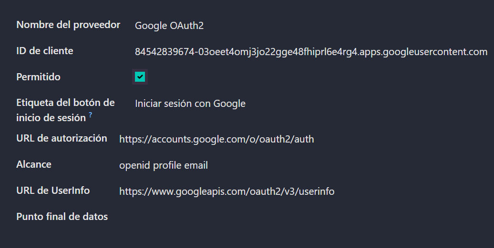

---

Si ahora volvemos a **"Ajustes"** y busamos el apartado de **"Correos electrónicos"** habilitamos la casilla **"Utilizar servidores de correo electrónico personalizados"** y abajo veremos unos apartados para insertar un ID y un secreto, son los mismos que conseguimos antes, los copiamos y pegamos ahí y guardamos.
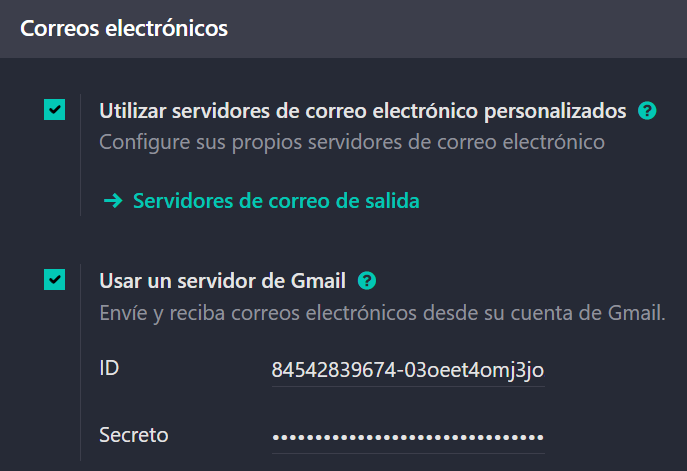
