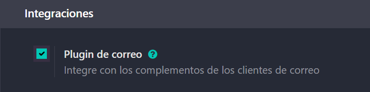
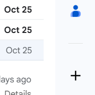
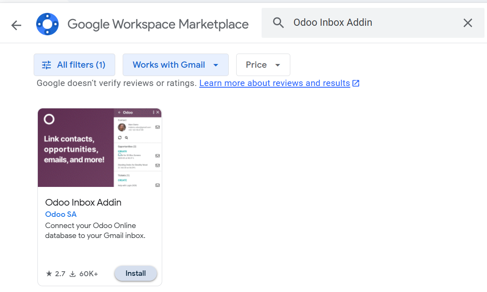
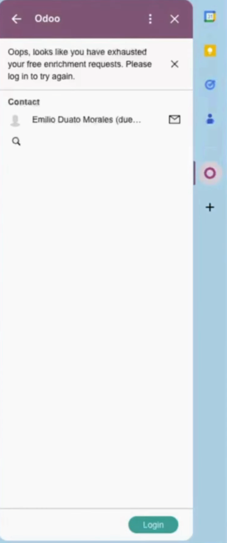
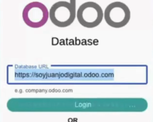
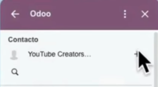

# 05 — Integración con Gmail (OAuth GCP + Add-on)

## Requisitos

- Cuenta Google Cloud (GCP).

## Pasos resumidos

1. [**Activar plugin de correo** en Odoo e instalar *Odoo Inbox Add-on* en Gmail.](#activar-plugin-de-correo-en-odoo-e-instalar-odoo-inbox-add-on-en-gmail)
2. [En **Google Cloud Console**: habilitar *Gmail API*, crear **OAuth Client (Web)**, configurar **redirect URI** de Odoo.](#en-google-cloud-console-habilitar-gmail-api-crear-oauth-client-web-configurar-redirect-uri-de-odoo)
3. [Copiar **Client ID/Secret** a Odoo (Gmail server settings) y **Guardar**.](#copiar-client-idsecret-a-odoo-gmail-server-settings-y-guardar)
4. [Probar desde Gmail: crear contacto/oportunidad desde el add-on.](#probar-desde-gmail-crear-contactooportunidad-desde-el-add-on)

## **Activar plugin de correo** en Odoo e instalar *Odoo Inbox Add-on* en Gmail.
Vamos a activar el plugin de correo en Odoo, para ello iremos a la app de **"Ajustes"**, ahora buscaremos el panel de **"Integraciones"**, ahí marcamos la casilla que pone **"Plugin de correo"** (Recuerda darle a **"Guardar"**).

---

Ahora instalaremos **"Odoo Inbox Add-on"**, para ello abriremos nuestro **"Gmail"**, buscaremos en el panel derecho el botón con el símbolo del + y pincharemos.

---

Ahora se nos desplegará una ventana donde podremos buscar el add-on, buscaremos **"Odoo Inbox Addin"** y tras encontrar el restultado pincharemos en instalar (Nos pedirá algunas verificaciones y permisos).

---

Una vez instalado veremos en el panel derecho de nuestro Gmail el icono de Odoo, al pinchar abriremos un panel que nos pedirá que **abramos un correo que tengamos**, veremos que en el panel aparece la persona que nos envió ese correo y un pequeño error que sugiere que **iniciemos sesión** abajo donde pone **"Login"**.

---

Deberás introducir la url de tu base de datos de Odoo para loguearte, luego nos pedirá permisos y pincharemos en **"Permitir"**, si tras esto vemos un mensaje que pone **"Success!"** es que lo has hecho bien, si no revisa los pasos anteriores.

---

Si refrescas la página podras ver en el panel muchos datos de la empresa que nos mandó el correo lo cual no será muy útil, en el icono del + al lado del nombre de la empresa podrás agregarla a tu base de datos (Veremos que desde ahí ya podremos crear oportunidades y tareas).

## En **Google Cloud Console**: habilitar *Gmail API*, crear **OAuth Client (Web)**, configurar **redirect URI** de Odoo.

## Copiar **Client ID/Secret** a Odoo (Gmail server settings) y **Guardar**.

## Probar desde Gmail: crear contacto/oportunidad desde el add-on.
