# 06 — Contactos

- [Acceso al módulo](#acceso-al-módulo)
- [Etiquetas](#etiquetas)
- [Importación CSV.](#importación-csv)
- [Portal de cliente (opcional).](#portal-de-cliente-opcional)

## Acceso al módulo
Para acceder al módulo de contactos primeramente lo buscaremos y haremos click en el panel de módulos.
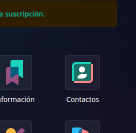

---

Al entrar verás una lista con tus contactos.
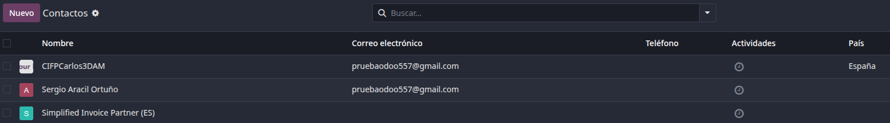

---

Si pinchas en un contacto verás el siguiente panel:
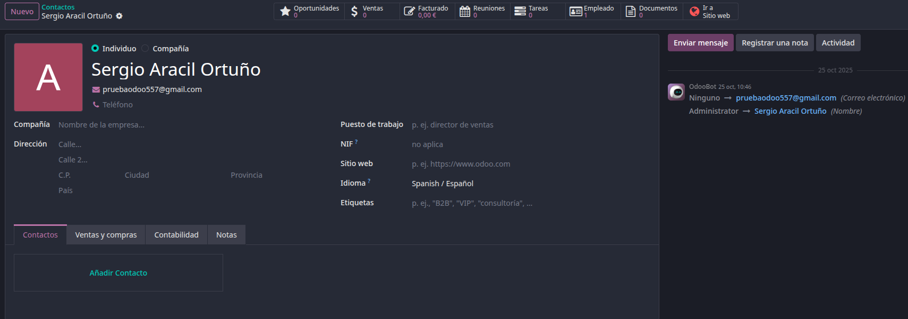

## Etiquetas
Dentro del panel de un contacto puedes añadir **"Etiquetas"** con las que podrás definir, filtrar ciertos contactos a tu gusto, como definir un contacto como "Proveedor" y así con todos tus proveedores, buscas el apartado de **"Etiquetas"** y pinchas en **"Crear"**.
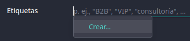

---

Una vez hayas pinchado verás una ventana donde podrás escribir el nombre de tu etiqueta, elegir un color para distinguirla más visualmente de otras, crear una categoría etc. (Recuerda darle a **"Guardar"**)
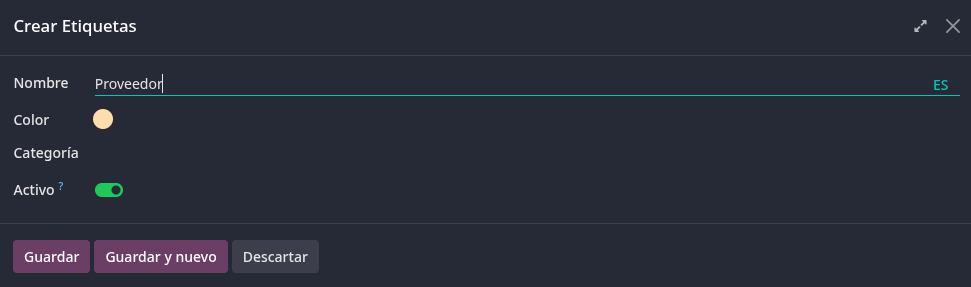

---

Ahora una vez creada, podrás buscar contactos filtrando por tus etiquetas.
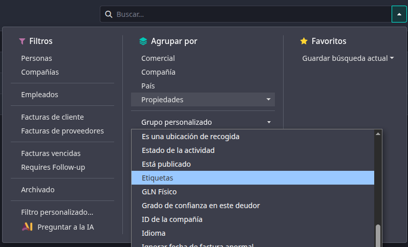

---

Podrás ver varios desplegables dividos por la etiqueta a la que pertenecen.
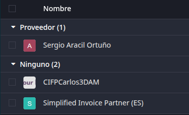

## Importación CSV.
Para importar una lista de contactos deberemos darle a la rueda de ajustes al lado de donde dice **"Contactos"** y pinchamos en **"Importar registros"**.
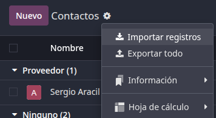

---

Ahora debemos descargar la plantilla csv haciendo click en el botón **"Import Template for Contacts"**:
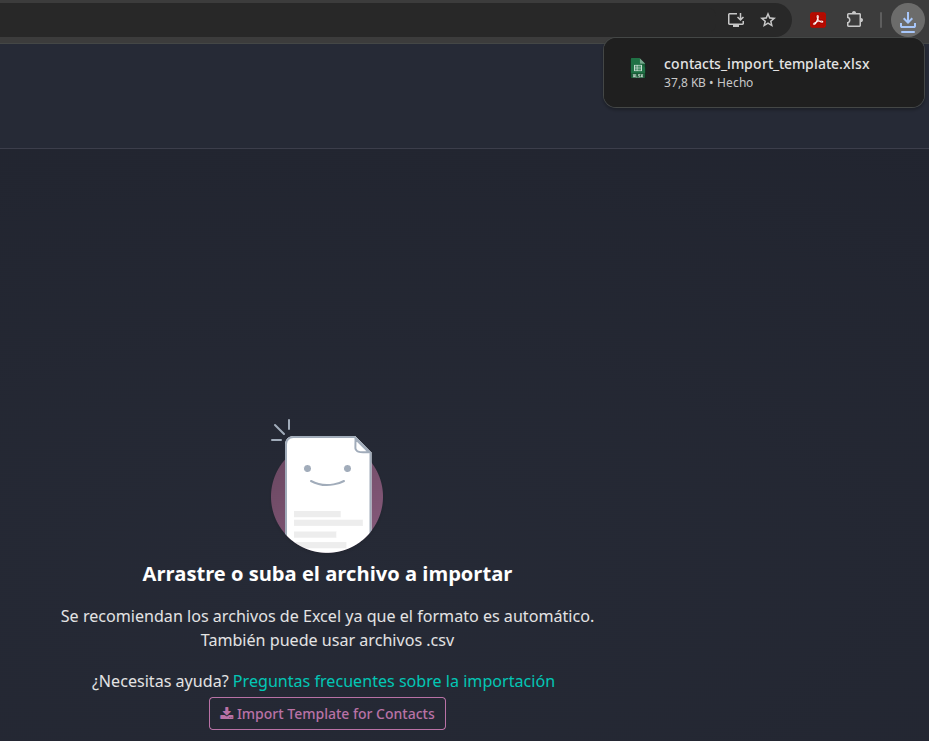

---

Si abrimos la plantilla deberemos rellenar la tabla con los datos de los contactos deseados.
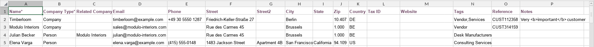

---

Al tener completa la plantilla y haber guardado el csv pincharás en **"Subir archivo de datos"** y seleccionas el csv.
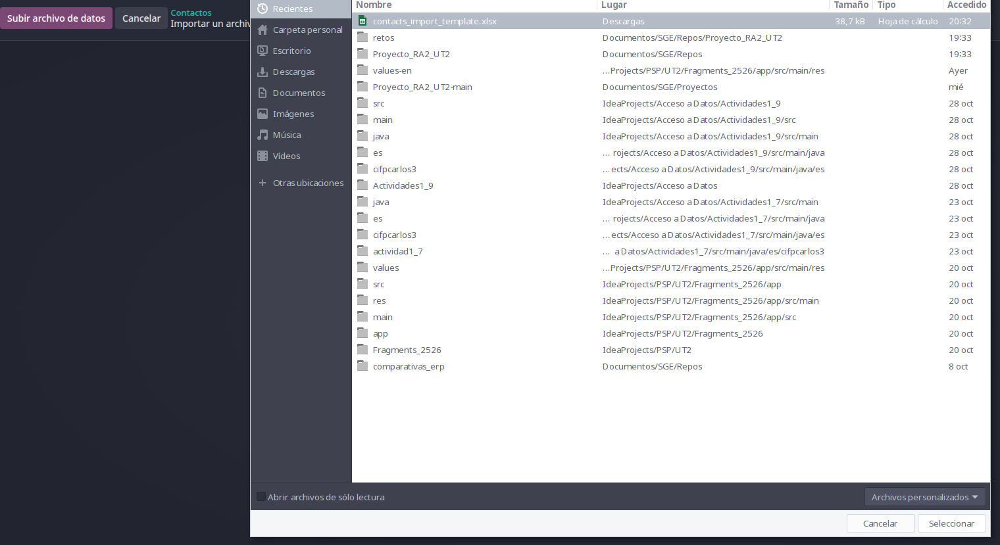

---

Podrás revisar los datos y te avisará de cualquier error antes de darle a **"Importar"**.
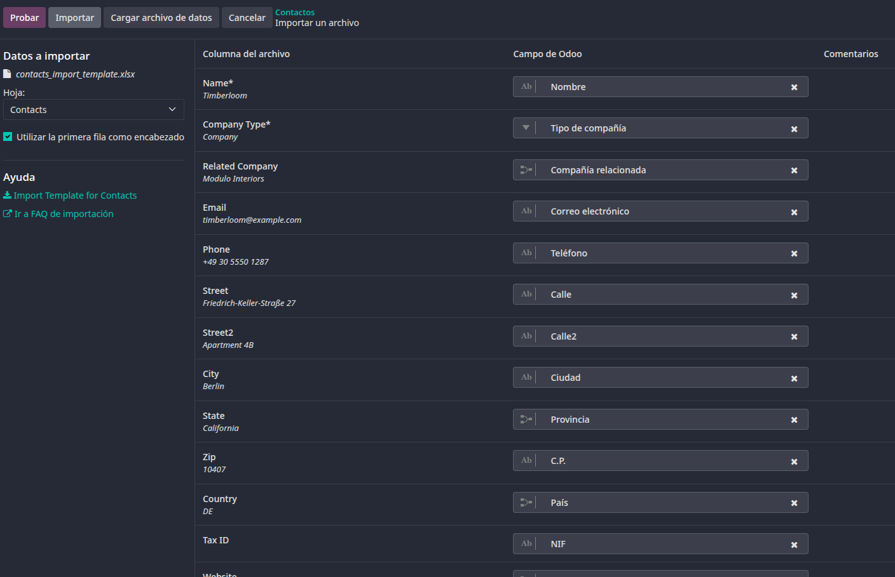

## Portal de cliente (opcional).
Para dar acceso al portal debes seleccionar un contacto o varios en el recuadro de casilla de la izquierda y luego pincharás en **"Acciones"** y después en **"Otorgar acceso al portal"**.
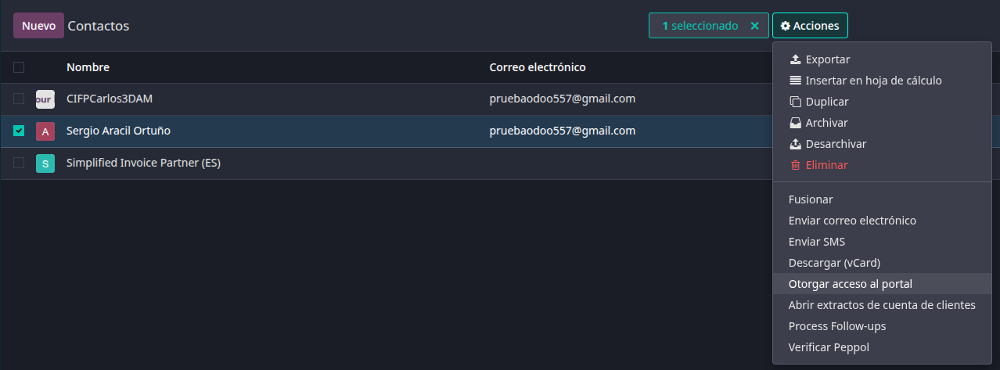

---

Se abrirá una ventana, selecciona los contactos que estarán en la lista que vayan a tener acceso al portal, el correo debe ser único y válido, si alguno coincide con alguno que ya esté en la lista se indicará, los que no estén te saldrá un botón que diga **"Dar acceso"**, y en el caso de los que lo tienen **"Revocar acceso"** o **"Volver a invitar"**.
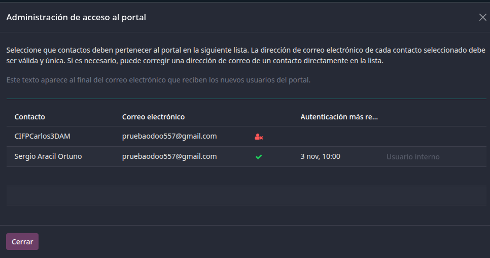