# 07 — Calendario y Citas

- [Calendario (día/semana/mes) + disponibilidad del equipo.](#calendario-díasemanames--disponibilidad-del-equipo)
- [**Integración con Google Calendar** (API OAuth GCP).](#integración-con-google-calendar-api-oauth-gcp)
- [**Odoo Meet** (videollamadas) o enlaces externos.](#odoo-meet-videollamadas-o-enlaces-externos)
- [**Módulo Citas** (Enterprise): enlaces públicos, buffers, preguntas previas.](#módulo-citas-enterprise-enlaces-públicos-buffers-preguntas-previas)

## Calendario (día/semana/mes) + disponibilidad del equipo.
El módulo de calendario se encuentra en el panel de módulos, haremos click sobre él para abrirlo.
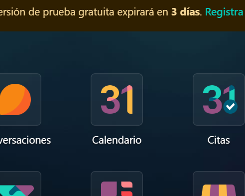

---

Una vez dentro podremos cambiar la vista del calendario por **Días, Semanas, Meses o Años** en un panel desplegable:
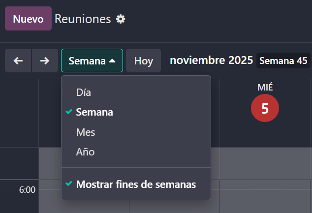

---

Además si añadiéramos más usuarios al equipo podríamos **ver todos sus calendarios** con sus eventos y actividades y así organizar citas, reuniones y demás con mayor precisión y organización.

## **Integración con Google Calendar** (API OAuth GCP).
Para integrar Google Calendar volveremos a **"Google Cloud Console"** y crearemos un nuevo proyecto (cuando acabe de crear el proyecto lo seleccionamos en **"notificaciones"**).
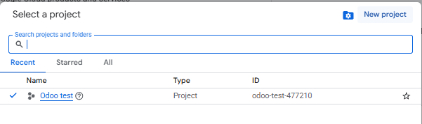
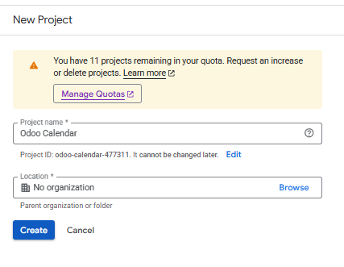

---

Ahora en al buscador escribiremos **"Google Calendar API"** y buscaremmos esta API:
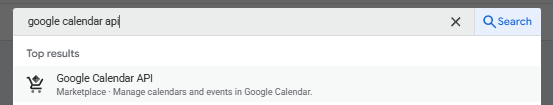

---

Pinchamos en **"Enable"** para habilitar la API (Si integraste la API de Gmail es muy parecido).
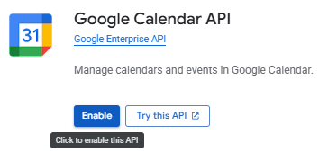

---

Ahora una vez habilitado pinchamos arriba donde pone **"Create credentials"**
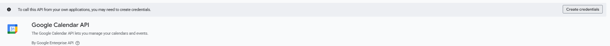

---

Una vez dentro pincharemos en la opción **"User data"** y luego en **"Next"**.
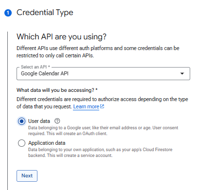

---

Ahora para nombre de la aplicación lo pondremos a nuestro gusto, el email del usuario de soporte será el nuestro y el del **"Developer Contact"** también, después pincha en **"Save and conitnue"**.
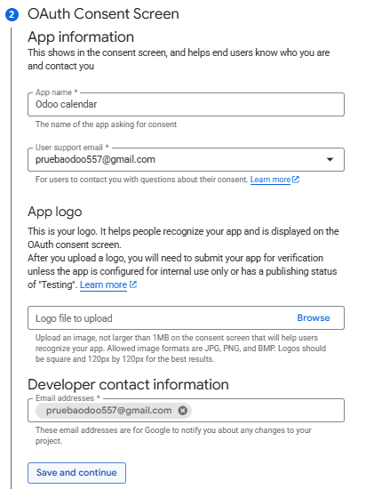

---

Aquí haremos click en **"Add or remove scopes"**, seleccionaremos los permisos que queramos, arriba podemos filtrar por los permisos de **"Google Calendar API"**, al acabar de seleccionarlos le damos a **"Update"** (en nuestro caso le hemos dado todos los permisos de **"Google Calendar API"** y el **"openid"**), tras esto volvemos a darle a **"Save and continue"**.
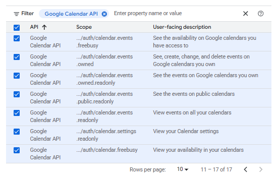

---

En es punto en nuestro caso estableceremos el tipo de aplicación como **"Web application"**, el nombre será de nuevo a nuestro gusto, la url será basada en el siguiente modelo (https://tunombre.odoo.com/google_account/athentication), sustituye tunombre por el tuyo en Odoo, lo verás arriba en la url dentro de Odoo, termina dándo a **"Create"**.
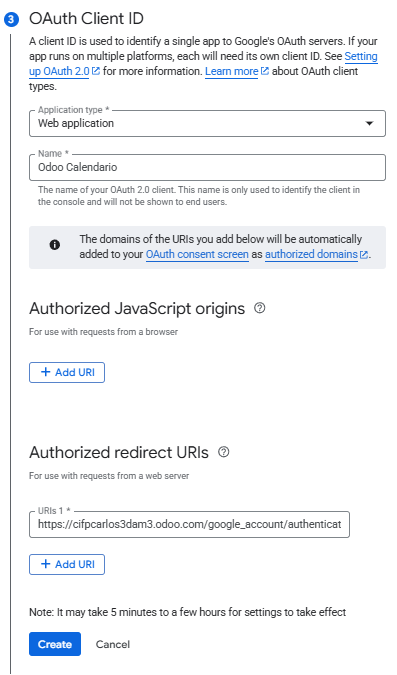

---

Una vez terminado le damos a **"Done"** y en el panel de la izquierda pinchamos en **"Credentials"** y buscamos nuestro poryecto para hacer click sobre él.
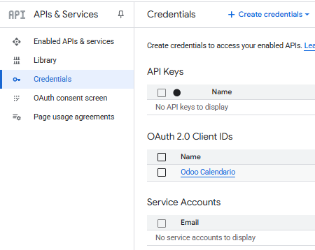

---

Veremos el ID de cliente y el Secreto del cliente:
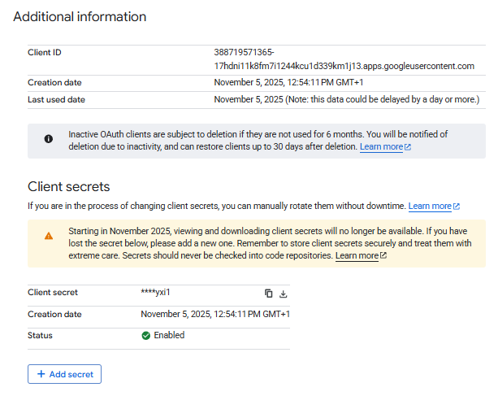

---

Una vez teniendo esto volveremos a Odoo y vamos a **"Ajustes"** iremos al apartado de la izquierda que dice **"Calendario"**, copiaremos el ID de cliente y el secreto y lo pegamos en sus campos, acuérdate de guardar los cambios.
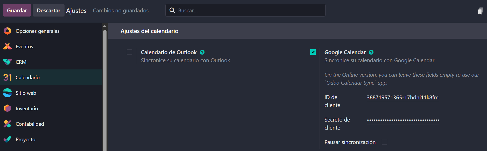

---

Para crear un nuevo evento en el calendario haremos click en la celda del calendario donde se vaya a iniciar el evento según el día y la hora, se nos abrirá el siguiente panel donde podemos establecer un **título**, definir los **días que estará activo el evento**, cuándo queremos que nos notifique del evento por emai, sms etc. Además entre otras opciones podemos poner un **enlace de videollamada** como de Meet o Zoom o incluso abrir una **"Reunión de Odoo"** como dice el botón para no tener que usar esos servicios, al acabar pinchamos en **"Send email"** y se notificará del evento al resto.
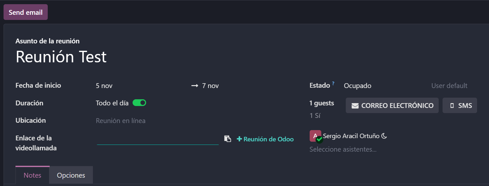

## **Odoo Meet** (videollamadas) o enlaces externos.
Profundizando en la opción de realizar videollamadas con Odoo Meet nos unimos a una llamada desde el evento o el propio enlace.
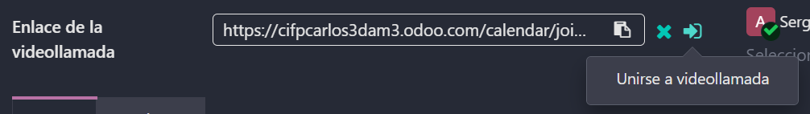

---

Una vez dentro podemos activar y desactivar micro y cámara y nos uniremos a la llamada pinchando en **"Join call"**.
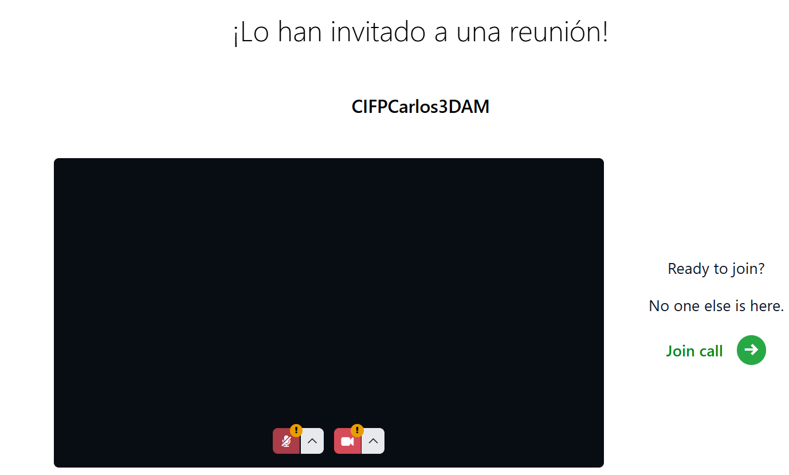

---

Dentro de la llamado podemos compartir pantalla, en los tres iconos de la derecha podemos invitar a más usuarios, abrir el chat de texto y explorar más opciones dentro de la llamada.
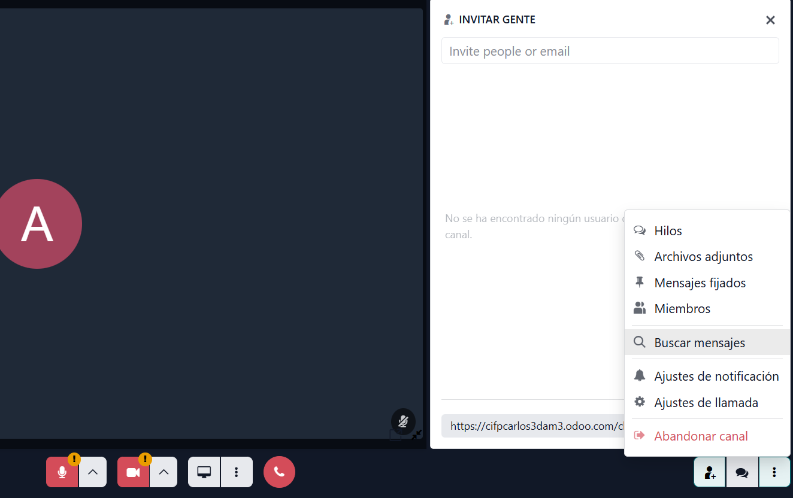

## **Módulo Citas** (Enterprise): enlaces públicos, buffers, preguntas previas.
El módulo de citas es de pago y debemos instalarlo manualmente, con él podemos ofrecer que una persona se apunte para darle un servicio o un espacio privado donde interactuar y atenderle.
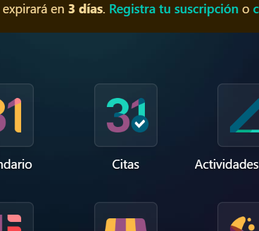

---

Dentro podemos el tipo de cita que queremos reservar si es para una reunión, para una llamada, una mesa, asientos de eventos etc.
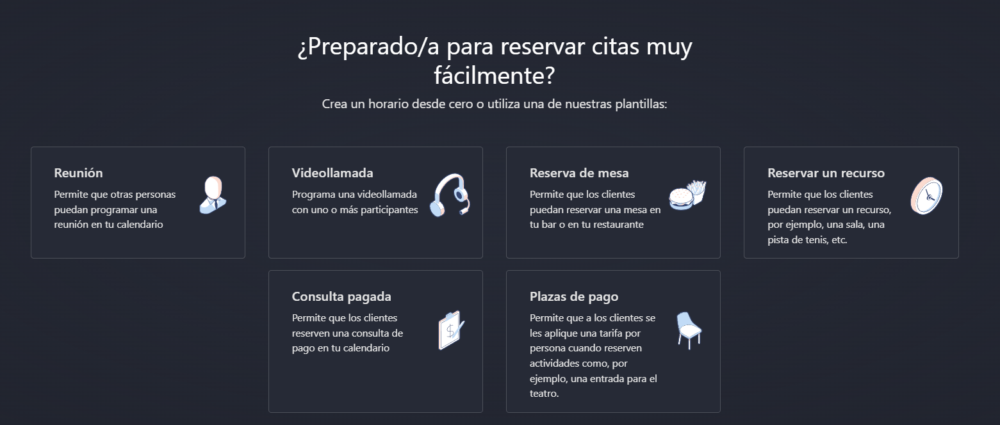

---

Una vez seleccionada la cita, podemos ponerle un **título, la duración, ubicación, enlace a videollamada** si la hubiese, incluso editar la **disponibilidad** que aparece por defecto.
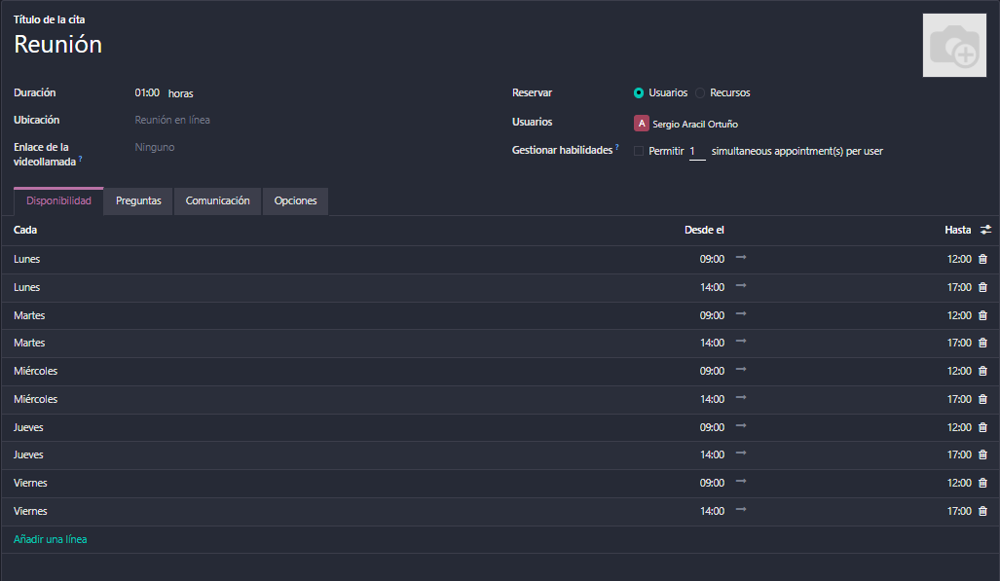

---

Hay un apartado de preguntas para hacerle al usuario antes de la cita estableciendo el tipo de resupuesta que se espera, la resupuesta que te da y un campo que marca si la respuesta a esa pregunta es obligatoria.
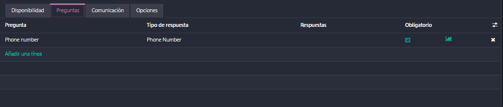

---

Una vez configurado todo pincharemos en **"Compartir"** y nos aparecerá el enlace de la cita que podremos copiar, este enlace será en el que entre el usuario rellenando los campos de horario, datos y preguntas y al finalizar habrá creado una cita que ambos verán en su calendario.

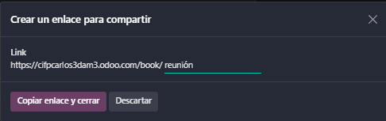
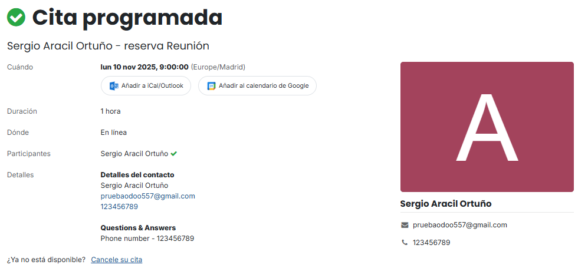
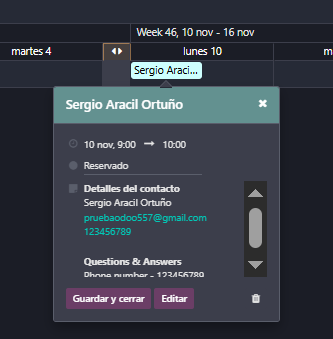