# 08 — Proyectos (Kanban)

- [Proyectos, etapas, tareas, **subtareas**.](#proyectos-etapas-tareas-subtareas)
- [**Tareas recurrentes**, **dependencias**, **hitos**.](#tareas-recurrentes-dependencias-hitos)
- [Vistas: tarjetas, lista, calendario propio.](#vistas-tarjetas-lista-calendario-propio)
- [Registro rápido de actividades y **calificación del cliente**.](#registro-rápido-de-actividades-y-calificación-del-cliente)

## Proyectos, etapas, tareas, **subtareas**.

Vamos a entrar al módulo de **"Proyecto"**.

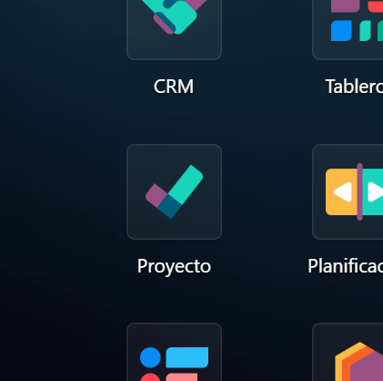

---

Vamos a crear un proyecto haciendo click en **"Nuevo"**, donde vamos a poder darle un nombre a nuestro proyecto y tenemos la opción de establecer un **correo del que se enviarán todas las notificaciones de ese proyecto**, puede ser útil si hay **varios proyectos**.

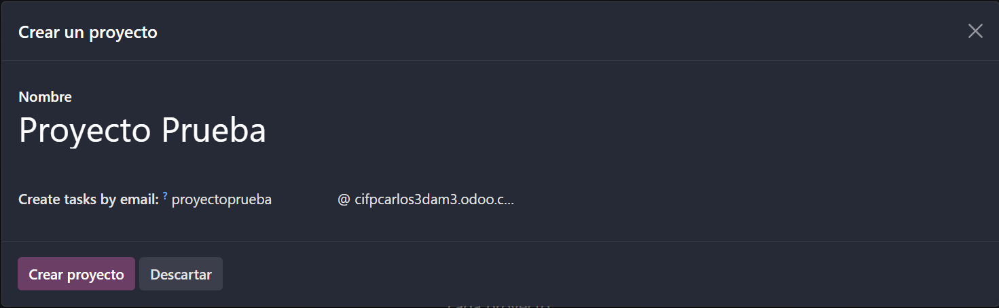

---

Una vez creado vamos a establecer las diferentes etapas que puede tener nuestro proyecto, cada que añades una podrás escribir otra según ya las etapas que le quieras dar a tu proyecto.

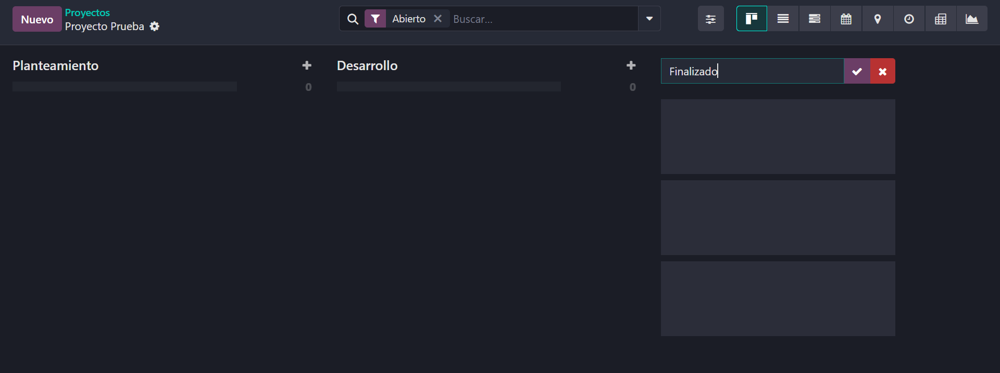

---

Sobre una etapa poder pinchar en el icono del + para añadir una tarea a esa etapa y asignarle esa tarea a unos usuarios.

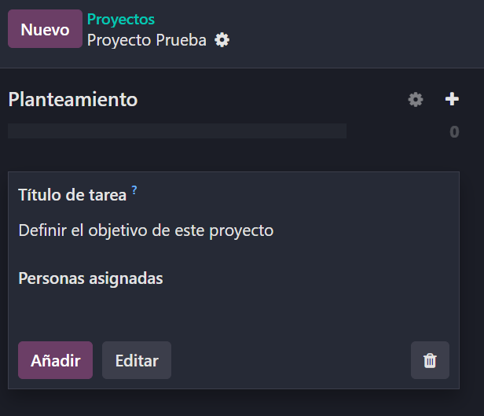

---

Una vez creada podemos editar una tarea pinchando sobre ella, en este panel vamos a poder agregar una descripción a la tarea, añadir etiquetas, clientes, fechas límite y establecer una prioridad para cada tarea siendo simbolizada con las estrellitas.

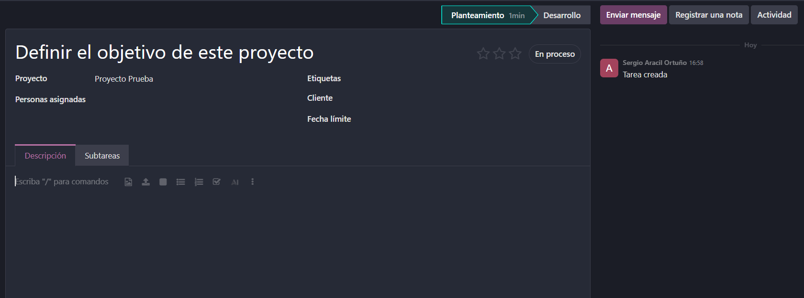

---

Además de prioridad podemos modificar el estado de la tarea conforme se trabaja en ella, llevaremos un registro de todos los cambios en el panel de la derecha y podremos mover la tarea de una etapa a otra.

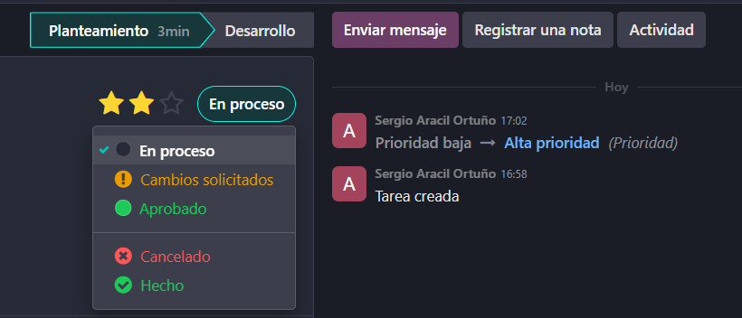

---

Luego en el apartado **"Subtareas"** vamos a poder crear subtareas para nuestras tareas especificando nuevamente prioridad, fecha, descripción y cuanto quieras, además si luego entras en una subtareo podrás persnalizarla igual como hemos visto y a esa subtarea añadirle una subtarea.

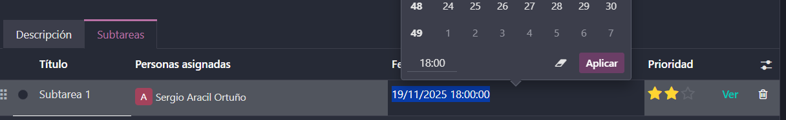

---

Podemos visualizar de forma más cómoda la etapa en la que se encuentra cada proyecto yendo a **"Ajustes"** y en el apartado de **"Proyecto"** en el panel izquierdo, marcaremos la casilla **"Etapas del proyecto"**, nos aseguramos de guardar y haremos click en **"Cofigurar etapas"**.

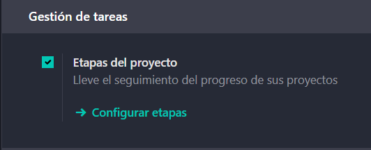

---

Ahora nuestros proyectos se ven categorizados por estas etapas predefinidas:

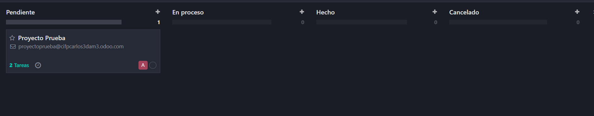

## **Tareas recurrentes**, **dependencias**, **hitos**.

Vamos a definir tareas recurrentes, estas son tareas que se seguirán haciendo constantemente una y otra vez hasta cuando nostros definamos. Para ello entramos en **"Proyecto"** y en los tres puntitos pinchamos en los ajustes.

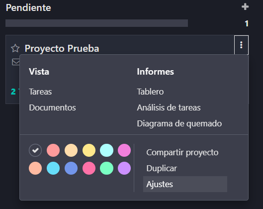

---

Una vez dentro vamos a la pestaña de **"Ajustes"** y bajamos a la sección de **"Gestión de tareas"** y marcamos la casilla **"Tareas recurrentes"** (recuerda guardar el ajuste).

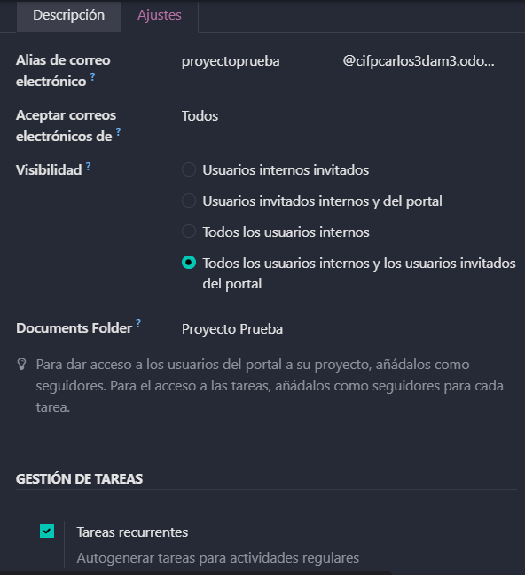

---

Ahora si entramos dentro de una tarea veremos un icono de una flecha haciendo un círculo, si la pinchamos haremos esta tarea recurrente, y podemos configurar cuántas veces se repetirá cada tanto y hasta cuando, esto último puede ser para siempre si lo elegimos.

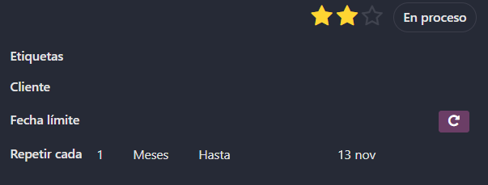

---

Si volvemos a los ajustes del proyecto podemos activar las **Dependencias de tareas**, esto hace que podamos definir el orden en el que se tienen que completar las tareas (recuerda guardar el ajuste).

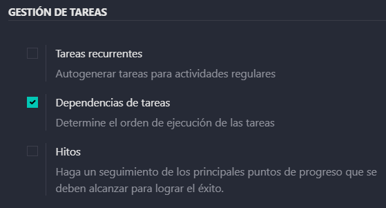

---

Entramos en una de nuestras tareas, nos aparece una nueva pestaña que pone **"Bloqueado por"**, pinchamos y podemos añadir una nueva línea, ahí definimos qué tareas deben hacerse antes que esta y la bloquearán hasta que se completen.

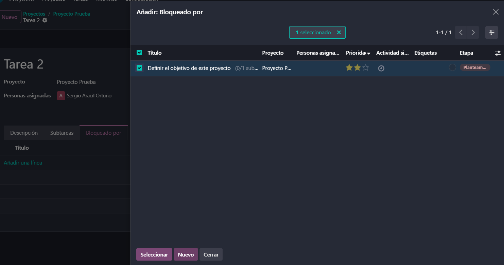

---

Volviendo de nuevo a los ajustes de **"Proyecto"** encontramos en el mismo apartado la casilla de **"Hitos"** la cuál marcaremos, estos hitos definen los principales puntos que se deben cumplir y realizar que determinan el éxito del proyeto.

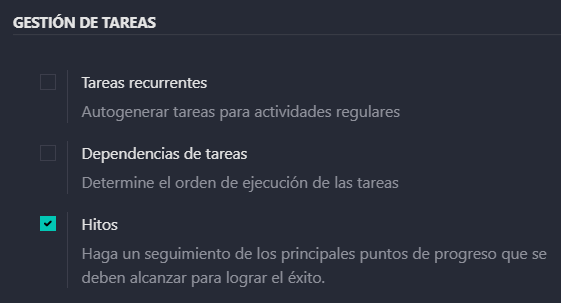

---

Podemos ver los hitos actuales si vamos al panel de proyectos, pinchamos en los tres puntitos del proyecto del que queramos ver sus hitos, y picharemos en **"Hitos"** ahí verás el panel con todos tus hitos.
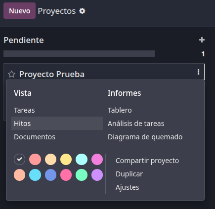

---

Si pinchas en **"Nuevo"** podrás crear un hito, para ello rellenamos los campos para darle un nombre, una fecha límite y una casilla que indica si se alcanzó el hito o no, al finaliza pincha en **"Guardar"**.
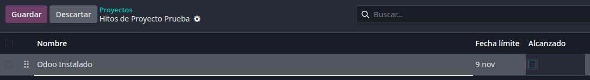

## Vistas: tarjetas, lista, calendario propio.

Una vez dentro de un proyecto puedes cambiar la vista de tu proyecto arriba a la derecha pudiendo cambiar la vista a **"Kanban"**, **"Lista"**, **"Calendario"** etc.
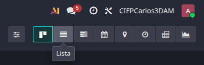

Vista Kanban (Etiqueta):
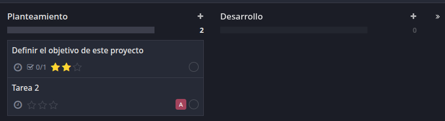

Vista Lista:
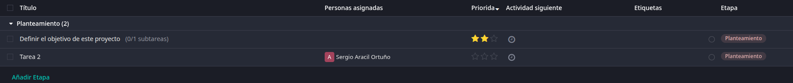

Vista Calendario:
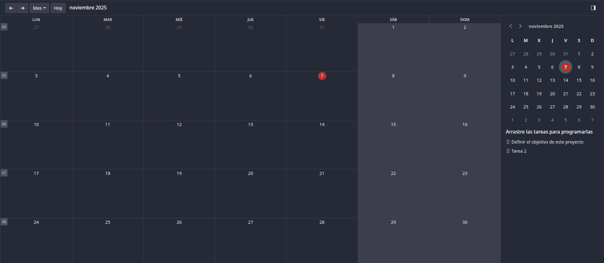

## Registro rápido de actividades y **calificación del cliente**.

Para visualizar rápidamente las tareas podemos ir pinchar dentro del módulo de **"Proyecto"** arriba en **Tareas**, pudiendo elegir entre ver **"Mis Tareas"** o **"Todas las tareas"**.
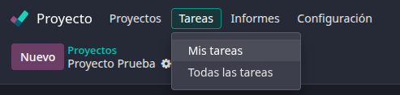

Así puedes visualizar tus tareas:
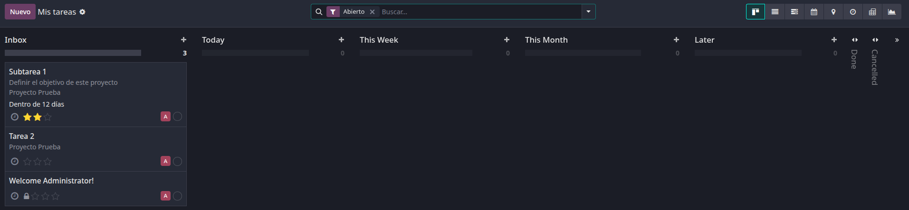

Así verás todas las tareas:
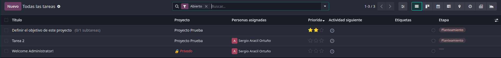

---

Para ver la calificación de clientes entramos en un proyecto, arriba pinchamos en **"Informes"** y se nos abrirá un desplegable y picncharemos en **"Clificación de clientes"**.
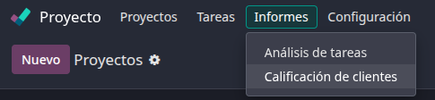

---

Así se verá el panel con las calificaciones, nuestro caso no tenemos aún.
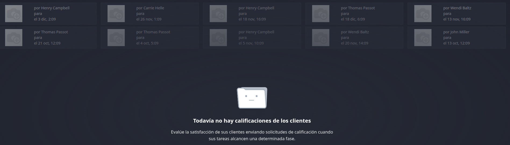