# 09 — Documentos, Firma e Información (Knowledge)

- [**Documentos**: repositorio, edición hojas, dividir PDFs, etiquetas/flujo.](#documentos-repositorio-edición-hojas-dividir-pdfs-etiquetasflujo)
- [**Firma electrónica**: campos (firma/nombre/fecha), envío y registro.](#firma-electrónica-campos-firmanombrefecha-envío-y-registro)
- [**Información (Knowledge)**: wiki tipo Notion, permisos y publicación.](#información-knowledge-wiki-tipo-notion-permisos-y-publicación)

## **Documentos**: repositorio, edición hojas, dividir PDFs, etiquetas/flujo.
Primeramente vamos a entrar en el módulo de **"Documentos"**.
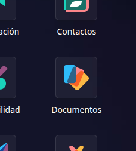

---

Una vez dentro, en el panel de la izquierda veremos la estructura de documentos dividida por nuestros proyectos, algunos módulos, empleados, participantes de los proyectos etc.
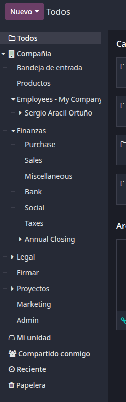

---

Si subiéramos una hoja de cálculo a nuestros documentos y quisiéramos abrirla haciendo click sobre ella, Odoo tiene un **integración con sus propias hojas de cálculo** y te permite abrir y editar la hoja desde la integración de Odoo.
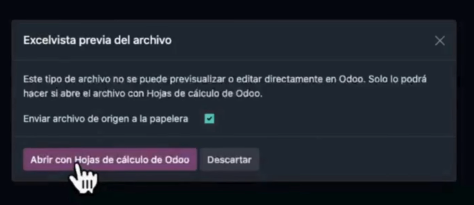

Hoja de cálculo en Odoo:
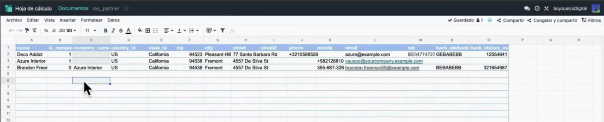

---

Si pinchamos en un pdf que tengamos podemos establecer una etiqueta al documento para poder definir por ejemplo si a partir de este documento voy a hacer una factura etc.
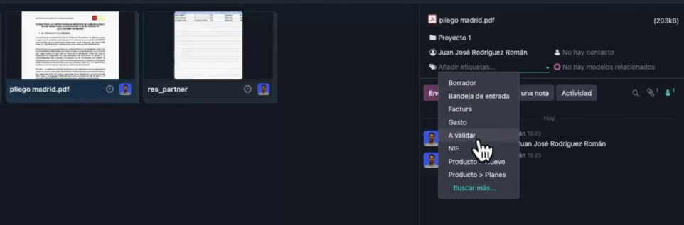

---

Luego habiendo pinchado en un PDF podemos pinchar arriba en **"Acciones"** y veremos una opción muy interesante que puede ser **"Dividir PDF"**, lo que nos permite dividir el pdf en varias hojas.
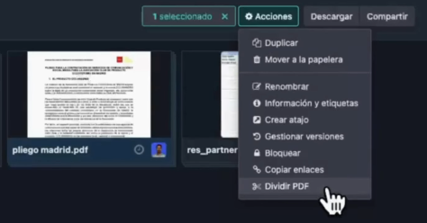

---

Dentro podemos elegir qué hojas separar y tener dentro de un pdf varios divididos.
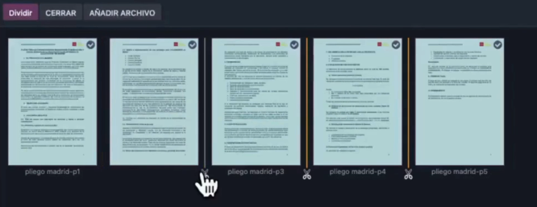

## **Firma electrónica**: campos (firma/nombre/fecha), envío y registro.
Podemos vincular la documentación con la firma electrónica entrando en el siguiente módulo:
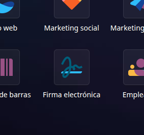

---

Una vez dentro en nuestro caso vamos a usar el documento de ejemplo para mostrar que podemos arrastrar cualquier campo en el panel izquierdo donde queramos poner nuestro nombre, firma, fecha etc. 
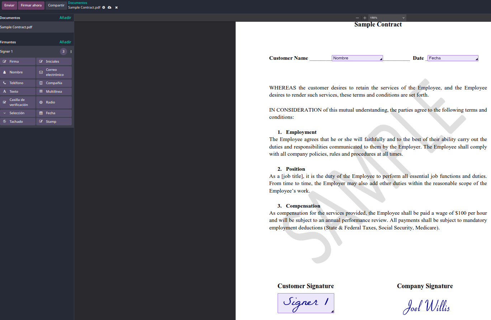

---

Podemos elegir a qué persona enviar este documento, con recordatorios, validez etc.
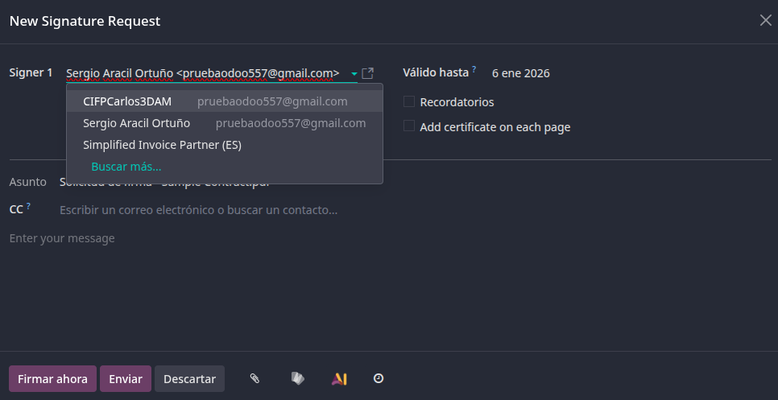

---

Si pinchamos en **"Firmar ahora"** haremos click en **HAZ CLIC PARA COMENZAR** y luego en **"Siguiente"**, conforme le demas empezará a rellenar el documento con nuestros datos e incluso nos crea una firma, podemos también dibujarla o cargar una, terminamos pinchando en **"Validar y enviar documento completado"**.
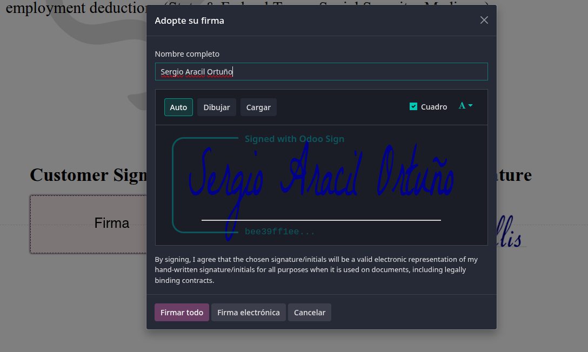

---

Al acabar podemos ver el registro de nuestros documentos.
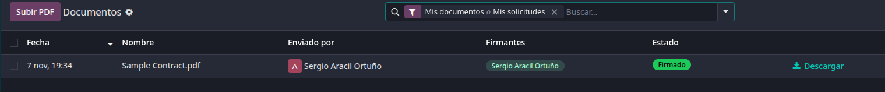

## **Información (Knowledge)**: wiki tipo Notion, permisos y publicación.
Vamos a ver el módulo de **"Información"**.
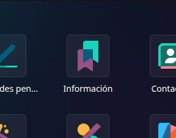

---

Está muy basado en **"Notion"**, aquí podemos crear un nuevo espacio de trabajo si pinchamos en ese mismo sitio en el panel de la izquierda en el símbolo del +, podremos editarlo como queramos haciendo portadas, insertando listas, imágenes, checklist, títulos, etc.
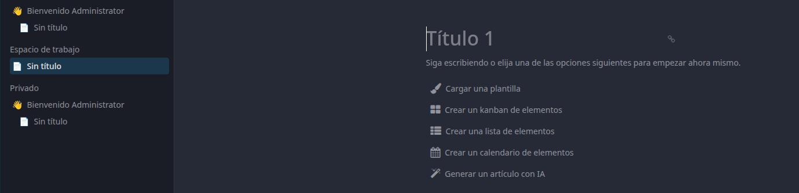

---

En estos tres puntos podemos encontrar varias utilidades como insertar emojis, portadas y demás.
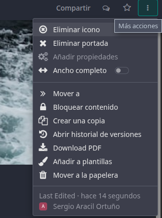

---

Podemos habilitarlo en la web pinchando en **"Compartir"** y habilitándolo, podremos copiar un enlace que nos llevará a esta misma página, también podemos ver que podemos establecer permisos generales y añadir personas con permisos personalizados.
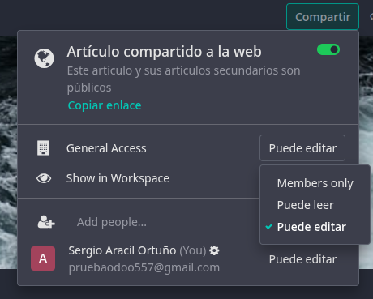
