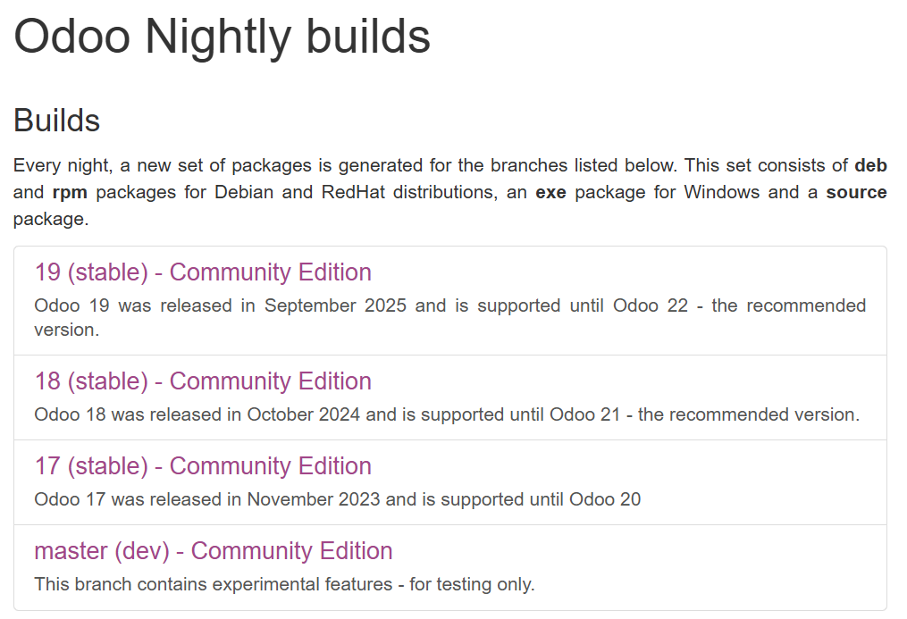

# 03 — Descarga del instalador de Odoo

## 1. Accede a la [**web oficial de Odoo**](https://www.odoo.com/es_ES/page/download) y localiza el **instalador para Windows**.
Aquí puedes encontrar todas las versiones estables de Odoo en nuestro caso vamos a descargar Odoo 19 Community para Windows, pinchamos en **"Descargar"**.

## 2. Descarga la **versión estable** que vayas a usar en clase (anota la **versión exacta**).
Dberías tener un archivo .exe como este:
   - 

> Resultado esperado: fichero `odoo_setup_<version>.exe` en tu equipo.
