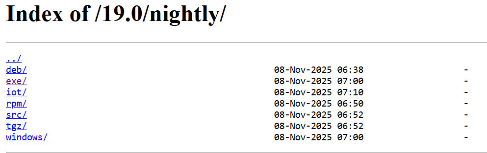

****# 03 — Descarga del instalador de Odoo

1. Accede a la [**web oficial de Odoo**](https://nightly.odoo.com/) y localiza el **instalador para Windows**.
Aquí puedes encontrar todas las versiones estables de Odoo Community en nuestro caso vamos a descragar Odoo 19.

---

La versión de Windows es la que pone **exe**, pinchamoes en ella.

2. Descarga la **versión estable** que vayas a usar en clase (anota la **versión exacta**).
   - 

> Resultado esperado: fichero `Odoo-<version>-setup.exe` en tu equipo.
