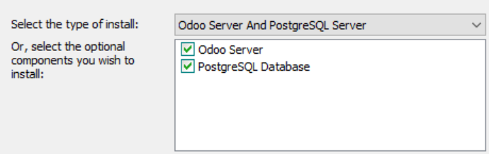
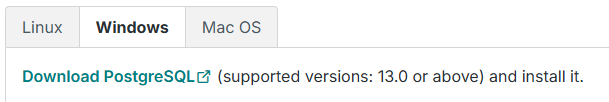
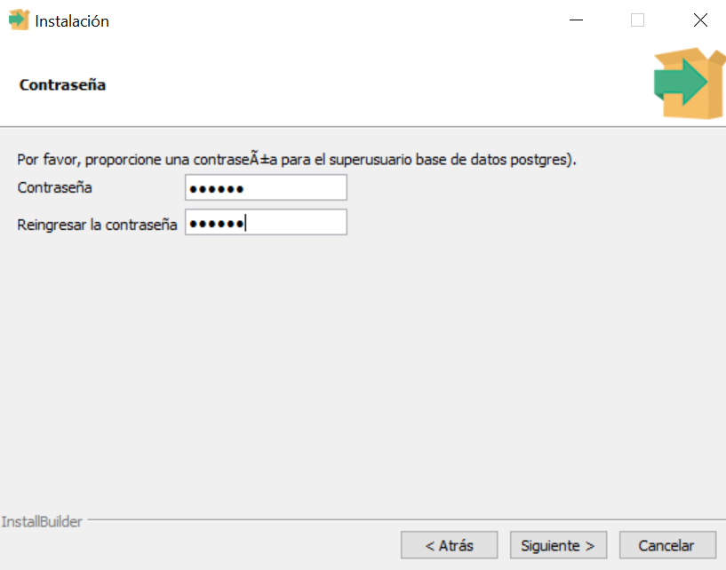

# 04 — PostgreSQL en Windows

> Odoo requiere **PostgreSQL**. Según instalador y versión, se incluye o puede requerir instalación separada.

 1. Verifica si el instalador de Odoo **instala PostgreSQL** automáticamente.

 
 2. Si no, descarga [**PostgreSQL para Windows**](https://www.postgresql.org/download/windows/) e instálalo:
   - Selecciona versión soportada por tu Odoo (en nuestro caso para Odoo 19 es 13.0 o superior).

   
   - Define usuario `postgres` y contraseña **segura** (anótala).
   El usuario está definido como **postgres** por defecto.
   - Daremos a todo **"siguiente"**, y pondremos un contraseña segura (anota ésta y el puerto).

   
3. Comprueba que el **servicio de PostgreSQL** está en ejecución (puedes hacerlo abriendo **"Servicios"** en Windows).

> Resultado esperado: PostgreSQL instalado y funcionando (usuario/puerto guardados).