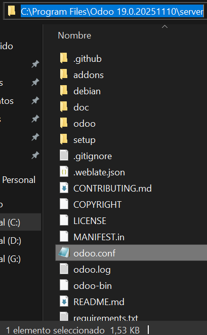
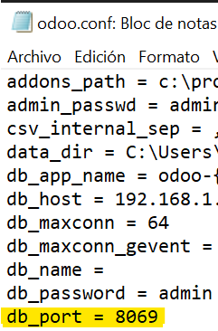

# 06 — Configuración inicial

1. Localiza archivos de **configuración** (si aplica) y el puerto por defecto (ej. `8069`).
En la siguiente ruta encontrarás los archivos de configuración, especialmente **odoo.conf**

    Dentro de odoo.conf en esta línea encontramos el puerto por defecto:
    
2. (Opcional) Ajusta idioma, zona horaria, y otros parámetros iniciales.
3. Anota la **URL de acceso local** (p. ej., `http://localhost:8069`).

> Resultado esperado: parámetros básicos identificados/documentados.
