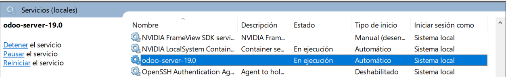
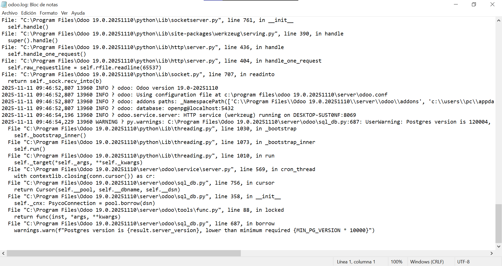

# 07 — Ejecución y servicio

1. Inicia Odoo mediante el **servicio de Windows** o acceso directo.
   Hemos entrado en **Servicios** de Windows y al encontrar el servicio pinchamos en **Iniciar**
   
2. Verifica el estado del servicio (**Servicios** de Windows).
   En nuestro caso puedes comprobar ahí mismo que el servicio está en ejecución tras iniciarlo.
3. (Opcional) Revisa logs si no arranca correctamente.
   Todo parece arrancar correctamente.
   

> Resultado esperado: Odoo en ejecución local.
