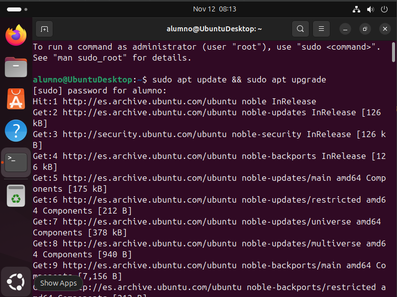
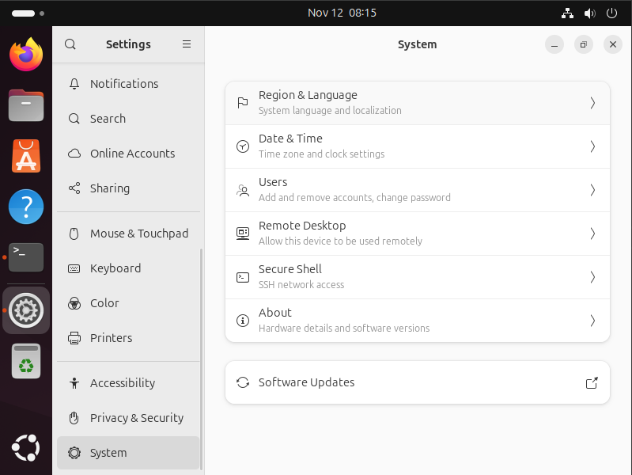

# 03 — Preparación del sistema

1. Actualiza índices y paquetes:

   ```bash
   sudo apt update && sudo apt upgrade
   ```
   

2. Configura zona horaria e idioma si procede.
   Si entras en **Settings**, podremos encontrar los ajustes de zona horaria e idioma abajo en el apartado **System**.
   
   
   - En **Region & Lenguage** deberás aplicar uno de los idiomas ya instalados o instalarlo si no está en la lista.
   - En **Date & Time** iremos a **Time Zone** y pondrás tu zona horaria.

- [ ] Sistema actualizado y listo para instalar dependencias.
