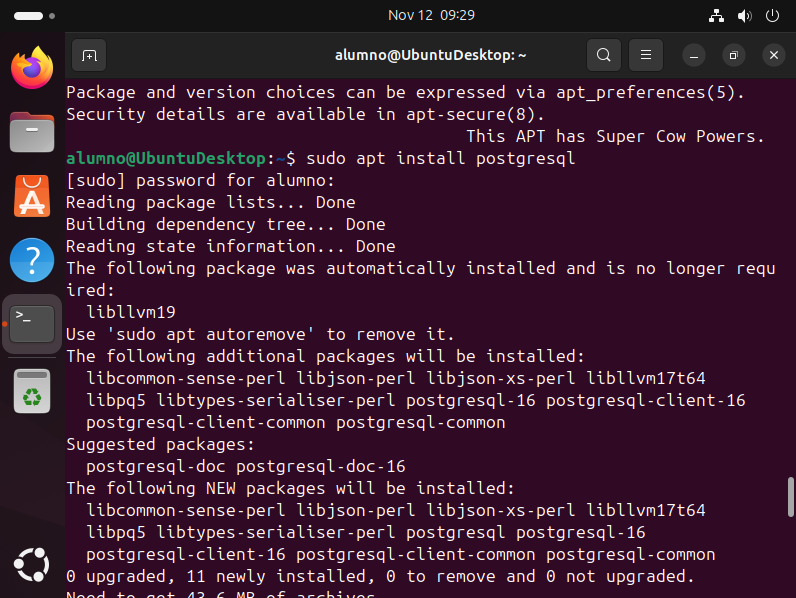
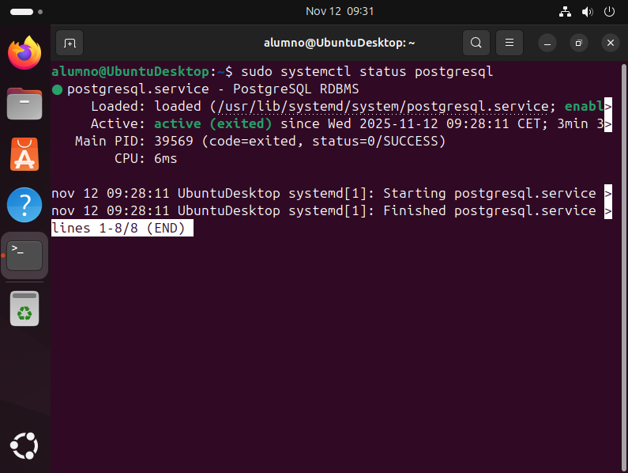
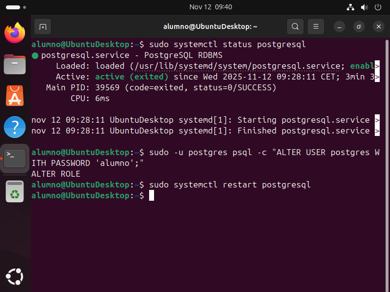

# 04 — PostgreSQL en Linux

1. Instala PostgreSQL desde repos:
   ```bash
   sudo apt install postgresql
   ```
   
2. Verifica el servicio:
   ```bash
   sudo systemctl status postgresql
   ```
   

3. (Opcional) Cambia contraseña del usuario `postgres` o crea rol específico para Odoo.

   Cambia la contraseña con (**IMPOTANTE** Reinicia el servicio tras loc cambios para aplicarlos):
   ```bash
   sudo -u postgres psql -c "ALTER USER postgres WITH PASSWORD 'nueva_contraseña';"
   ```
   

- [ ] PostgreSQL instalado
- [ ] Servicio Activo
