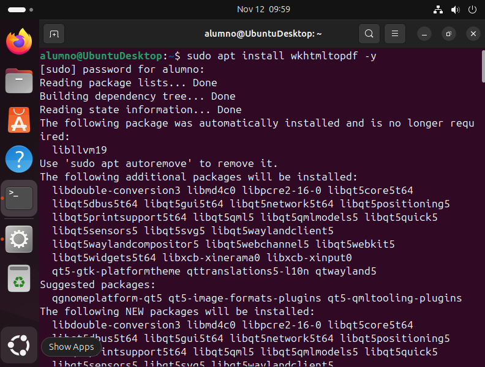
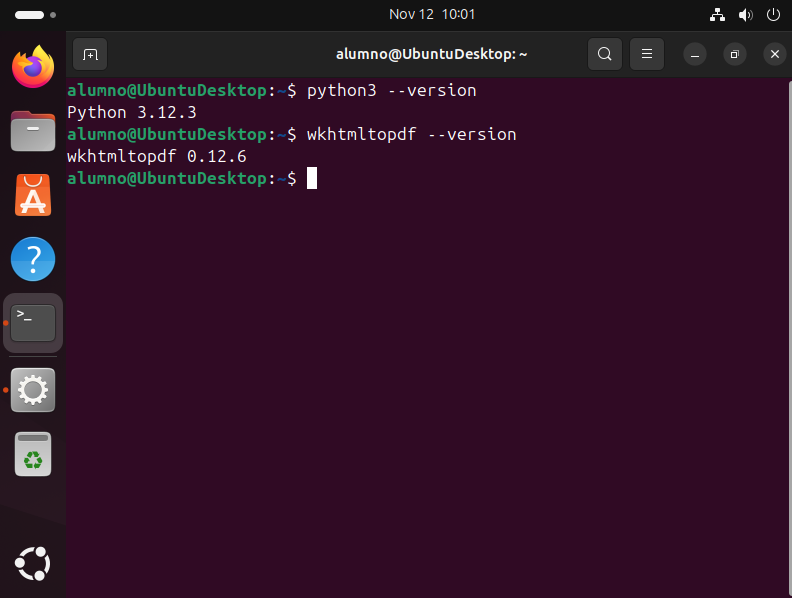

# 05 — Dependencias (Python, wkhtmltopdf, librerías)

###### 1. Instala Python y paquetes de compilación:
   **IMPORTANTE** En nuestro caso al estar en Ubuntu ya deberíamos tener Python instalado, puedes comprobarlo si vas al [Paso 3](#3-verifica-versiones) y lo verificas como indica ahí, si no intálalo así:
   ```bash
   sudo apt install python3 python3-pip python3-venv build-essential libxslt1-dev      libzip-dev libldap2-dev libsasl2-dev libjpeg-dev libpq-dev
   ```
###### 2. Instala **wkhtmltopdf** compatible (para reportes PDF).
   ```bash
   sudo apt install wkhtmltopdf -y
   ```
   (Con -y le decimos que sí a todo sin tener que responder a los Y/n).
   
###### 3. Verifica versiones:
   ```bash
   python3 --version
   wkhtmltopdf --version
   ```
   

- [ ] Dependencias instaladas y comprobadas.
