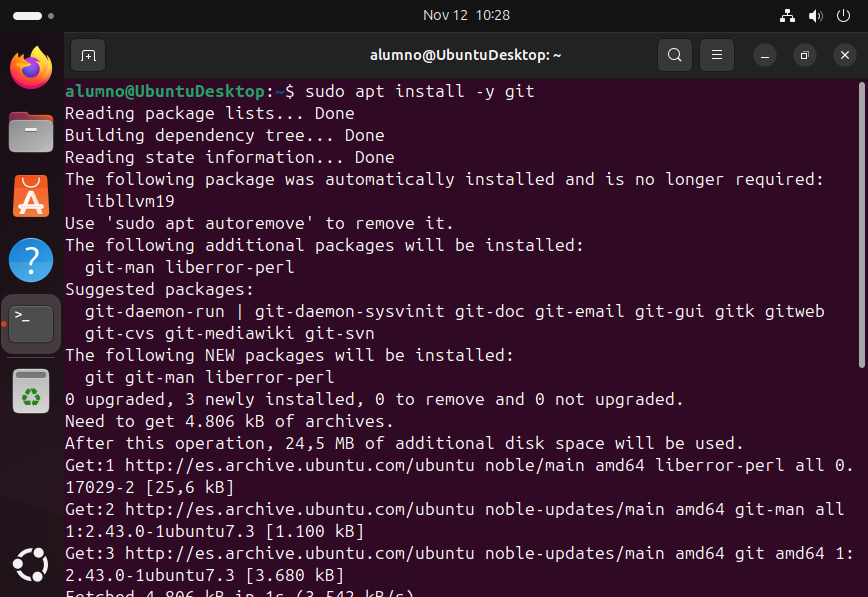
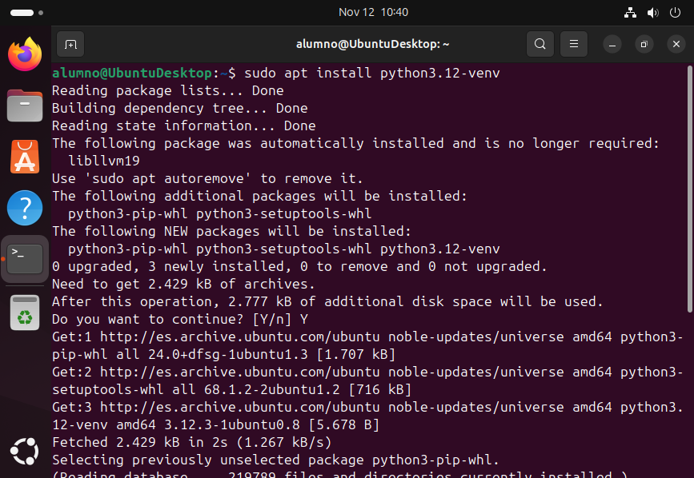
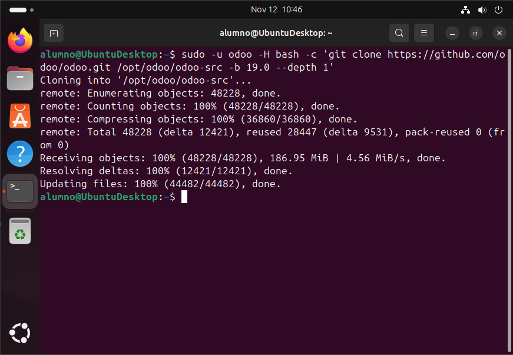
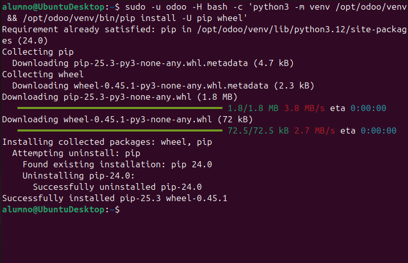
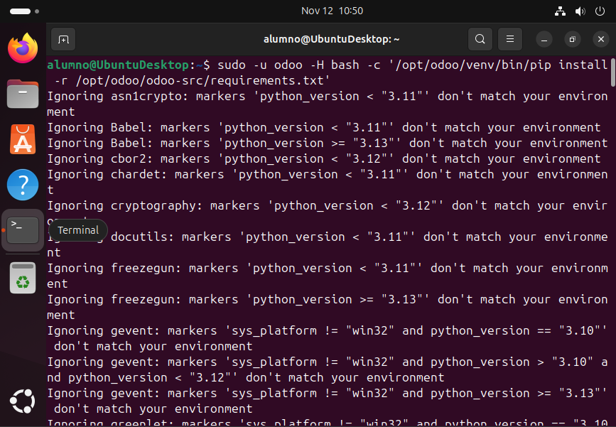

# 06 — Instalación de Odoo

## Desde código fuente (git)
1. Crea usuario del sistema `odoo` (sin shell de login si prefieres):
   ```bash
   sudo useradd -m -d /opt/odoo -U -r -s /bin/bash odoo
   ```
   
2. Instalamos git y :
   Primeramente necesitamos tener instalado git:
   ```bash
   sudo apt install -y git
   ```
   

   ---

   Debemos instalar **python3.12-venv** a pesar de que python ya viene instalado ya que el módulo -venv no siempre viene preinstalado.
   

   ---

   Clonamos el código fuente y creamos el entorno virtual:
   ```bash
   sudo -u odoo -H bash -c 'git clone https://github.com/odoo/odoo.git /opt/odoo/odoo-src -b <version>'
   sudo -u odoo -H bash -c 'python3 -m venv /opt/odoo/venv && /opt/odoo/venv/bin/pip install -U pip wheel'
   sudo -u odoo -H bash -c '/opt/odoo/venv/bin/pip install -r /opt/odoo/odoo-src/requirements.txt'
   ```
   
   
   

- [ ] Binarios/código de Odoo instalados.
