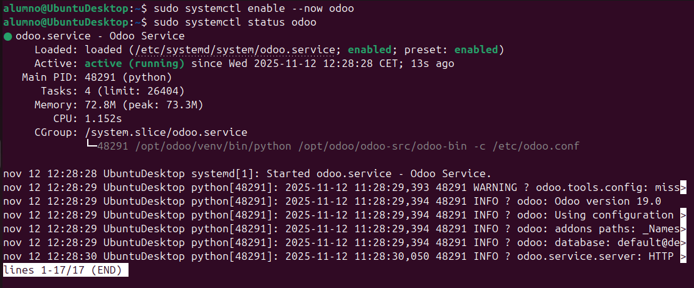

# 08 — Servicio systemd (`odoo.service`)

1. Crea el servicio en `/etc/systemd/system/odoo.service`:
   ```bash
   sudo nano /lib/systemd/system/odoo.service
   ```
   ```ini
   [Unit]
   Description=Odoo Open Source ERP and CRM
   After=network.target

   [Service]
   Type=simple
   User=odoo
   Group=odoo
   ExecStart=/usr/bin/odoo --config /etc/odoo/odoo.conf --logfile /var/log/odoo/odoo-server.log
   KillMode=mixed

   [Install]
   WantedBy=multi-user.target
   ```
2. Recarga y arranca:
   ```bash
   sudo systemctl daemon-reload
   sudo systemctl enable --now odoo
   sudo systemctl status odoo
   ```



- [ ] Servicio `odoo` activo y habilitado.
