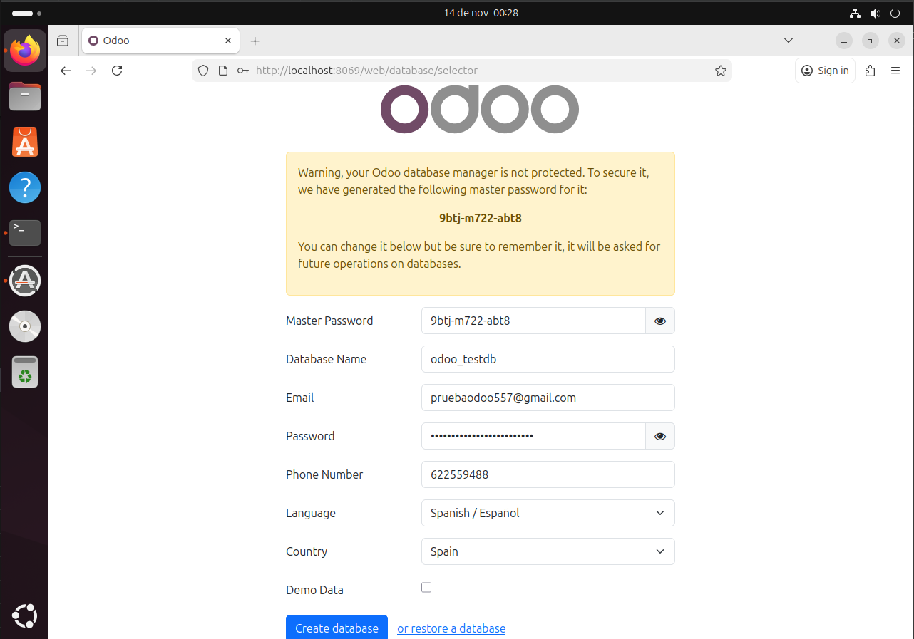
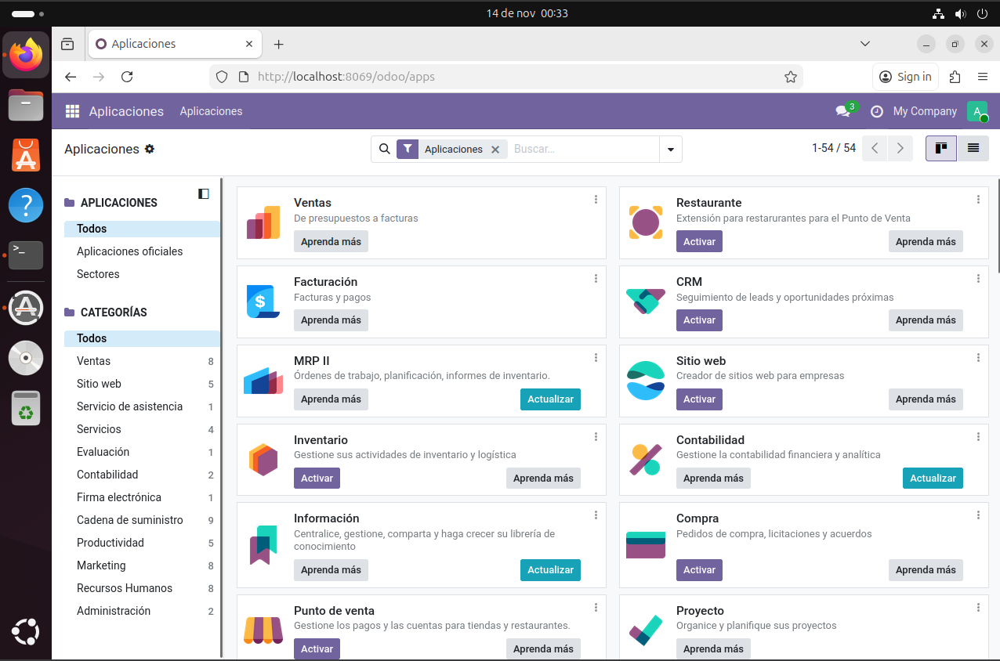

# 09 — Creación de base de datos de prueba

1. Accede a `http://localhost:8069`.
    
2. Crea una **base de datos nueva** con email/contraseña admin.
    Una vez dentro rellenamos los campos para crear nuestra base de datos y pinchamos en **"Create database"**.
3. Selecciona módulos iniciales si procede.
    Entrarás en la pestaña de aplicacione donde podrás elegir los módulos inicilaes dándole a **"Activar"**.
    

- [ ] BD de prueba creada y primer acceso.
